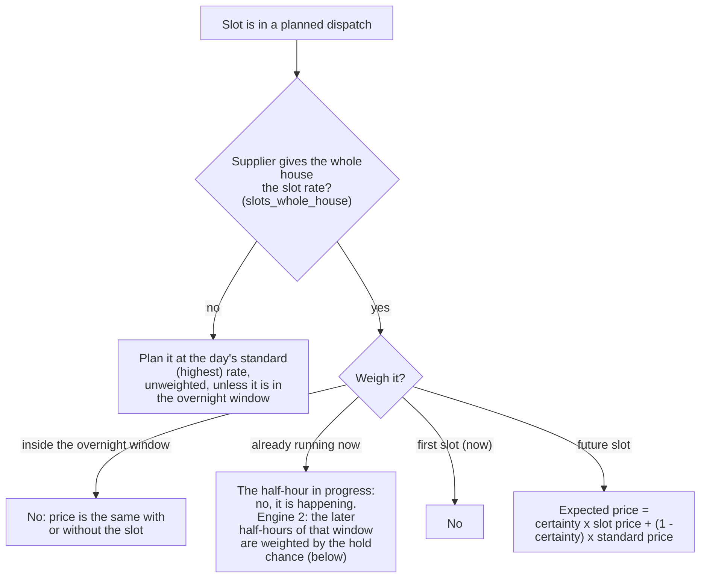

# 1. Inputs and certainty: what the plan knows

Code: `pe_core/readings.py` (`read`), `pe_core/forecast.py` (`build_slots`, `LoadProfile`), `pe_core/certainty.py`,
`pe_core/slots.py` (`SlotTracker`), `pe_core/tariff.py`, `pe_core/adapters/*`, and in the app `_params`,
`_learned_overrides`, `_apply_cold`, `_mark_manual`, `_maybe_replan`.

The plan is only as good as these inputs. This page lists each one, where it comes from, what is assumed when it is missing,
and how the planner is told how sure it is.

## 1.1 From readings to a plan

```mermaid
%%{init: {"htmlLabels": false, "flowchart": {"htmlLabels": false, "padding": 14, "nodeSpacing": 40, "rankSpacing": 50, "useMaxWidth": false}, "sequence": {"wrap": true, "useMaxWidth": false}}}%%
flowchart TD
    subgraph LIVE["Live readings, every 30 s (readings.read)"]
        L1["Battery SoC, battery power"]
        L2["Grid power, house power, solar power"]
        L3["Import rate now, export rate, standing charge"]
        L4["All published rates (30-min windows)"]
        L5["Smart-charge dispatches planned and completed"]
        L6["Grid event: active, start, end"]
        L7["Free-power session: active, start, end"]
        L8["Car charger: plug, status, power"]
        L9["Solar forecast totals"]
    end
    subgraph SLOTS["Per-slot build (forecast.build_slots)"]
        S1["Price per half-hour"]
        S2["Smart-slot flag + certainty"]
        S3["Solar kWh per half-hour"]
        S4["House load kWh per half-hour"]
        S5["Event, free, overnight flags"]
        S6["Car expected? car kW"]
    end
    subgraph ADJ["Adjusted in the app before planning"]
        A1["Cold-battery charge factor"]
        A2["Owner's override flags the slots"]
        A3["Learned limits replace the configured ones"]
    end
    L4 --> S1
    L5 --> S2
    L8 --> S6
    L6 --> S5
    L7 --> S5
    L9 -. "totals only for display" .-> S3
    S1 --> P["make_plan"]
    S2 --> P
    S3 --> P
    S4 --> P
    S5 --> P
    S6 --> P
    A1 --> P
    A2 --> P
    A3 --> P
    L1 -- "starting SoC" --> P
```

The slot list runs from the current half-hour to the end of the published prices, never shorter than **36 h** and never
longer than **48 h** (`build_slots`: `min_h=36`, `horizon_h=48`).

## 1.2 What each slot carries

| Slot field | Source | If it is missing |
|---|---|---|
| `price` (import, £/kWh) | The published rate for that half-hour (Kraken/Octopus-integration windows) | Beyond the published rates: the **same time yesterday**, marked `price_estimated`. Exception below. If even that is unknown: the current import rate |
| `export` (£/kWh) | The *current* export rate, copied to every slot | Priced at 0 in the physics (`step`) when unknown |
| `solar_kwh` | Forecast adapter (Solcast `detailedForecast`, `pv_estimate` x 0.5 h) | 0 kWh for that half-hour |
| `load_kwh` | House load profile for that weekday/weekend half-hour (below) | 500 W steady (`DEFAULT_LOAD_W`) until a profile exists |
| `smart_slot` | The slot overlaps a planned dispatch window | false |
| `axle` | The grid-event window overlaps the slot | false |
| `free` | The free-power window overlaps the slot | false |
| `overnight` | The slot's time of day is in the overnight window in use: learned from the rates, or the owner's fixed times (1.10) | false |
| `car_expected`, `car_kw` | Car state, see 1.5 | true only for the running half-hour while the car is charging; otherwise no car |
| `charge_factor` | Cold-battery caution (1.5 below) | 1.0 |
| `manual` | The owner's override (page 4) | none |
| `certainty`, `slot_price` | Smart-slot certainty (1.4) | none |

**Estimated prices beyond the published rates.** "Same time yesterday" would carry a smart slot's cheap price onto a day
where it will not exist. So if yesterday's price at that time was the day's minimum, the time is outside the overnight
window, and the day has a higher price, the slot is priced at yesterday's **maximum** instead (`price_at` in
`build_slots`). The plan shows `estimated_prices_from` so the card can say where estimates begin.

## 1.3 House load

`LoadProfile` (`forecast.py`) is the expected **house-only** load in watts for each (weekday or weekend, half-hour of day).

* Built from history (HA history at start-up, then PowerEngine's own recorded half-hours, which win).
* **House only**: the car's draw is subtracted (when the house load includes the car), because the car is planned
  separately in smart slots.
* Half-hours need at least 10 minutes of data to count.
* **Recency weighting**: a half-life of 7 days (`HALF_LIFE_DAYS`), so last week counts half as much as today.
* If a check meter is mapped and fresh (under 180 s old), the house figure is corrected by the difference between the
  inverter's grid meter and the check meter (`meter_corrected`, and `read` for live values). Reason in the log: the Solis
  meter read about 16% high both ways on 28 Sep 2026.
* A new profile triggers a replan.

## 1.4 Smart slots and certainty

A supplier "smart slot" (car dispatch) makes the **whole house** cheap for that half-hour. It is also *uncertain*: the
supplier can withdraw it, or it may be cut short when the car is full. The plan weighs it.

**Certainty** (`certainty.py`) is learned from what each past slot did (kept 30 days by `SlotTracker`):

| Slot outcome | Counts as |
|---|---|
| Ran to its end, and the supplier lists it as completed or the charger reported charging, unbroken, for at least the shortest real charge (2 minutes) | 1 (delivered) |
| Ran to its end but neither | 0 (probably not billed as a slot) |
| Cut short while running (and not carried on by another slot within 10 minutes) | 0.5 |
| Cancelled before it started | 0 |
| Cut short, but another slot began within 10 minutes (the supplier re-lists a running dispatch) | 1 if the charger reported an unbroken charge of that length or the supplier confirmed, else 0.5 |

"Charged" is the charger's own state, not energy: `SlotTracker` keeps, for each slot, the **longest unbroken run** of the
charger reporting "charging" (`longest_min`; a break starts the count again). The shortest run that counts is the
**Shortest real charge** setting (`car_min_charge_min`, 2 minutes). The car waking up and probing shows as bursts of 15 to
70 seconds drawing 0.01 kWh, so a slot full of them does not count however many there are (4 Oct 2026: blips under 1.2
minutes, the shortest real charge 3.7). The same figure scores the Health tab's smart-slot summary ("used", "done, no car"). It
has no part in how the plan treats the car (1.5). Records from before `longest_min` was kept use the total charging time.

With **Learn: shortest real charge** (`learn_car_min`, on) the figure moves from the setting towards what the history shows
(`slots.learn_min_charge`): the evidence is the slots the supplier lists as completed that the car charged in; the aim is half
of the 20th-percentile run of those; nothing moves until 8 of them are seen, then by n / (n + 20) of the way, within half to
double the setting (1 minute at the least). The figure in use is on the Health export (`smart_slots.min_charge_min`).

The overall score starts from a prior of **70% worth 4 slots**, so a few early results cannot swing it to 0 or 100. The
score is then worked out per group, pulled towards the overall figure until the group has about 4 slots of its own:

* time of day: **overnight** (23:00 to 06:00 local) or **daytime**;
* notice: **announced 2 h or more ahead**, or **short notice**.

**A window that has started (engine 2, 0.9.132).** The half-hour in progress is certain, because its price is on the tariff
now. The half-hours still to come in the same window are not: the supplier re-lists, shortens or drops a running dispatch, and
before 0.9.132 they were all counted as certain, so the plan sold the battery down hard on the strength of a window it could
not rely on (9 Oct 2026: 89% down to 31% in an afternoon window). `Certainty.hold()` is the chance that such a later
half-hour stands: over every window that began, the later half-hours it kept, divided by the later half-hours it had (a window
that ran to its end, or was cut short but carried on, kept all of them; one cut short kept those begun before the cut),
pulled towards the overall figure with the same weight as a group. It enters as a price like any other certainty
(`slot_prob` on the segment: the slot price with that chance, the standard price otherwise), so the plan is cautious by itself and
there is no separate rule. It is shown as `running` in the certainty summary on `sensor.pe_plan` and the Health export.

The plan shows each upcoming smart slot with its certainty and the price used (`slot_certainty` on `sensor.pe_plan`).

## 1.5 The car

**Since 0.9.103 the plan only believes the charger.** It no longer guesses whether the car is full, and it never waits for a
car to start.

| Question | Rule (`_car_expected` in `build_slots`) |
|---|---|
| Will the car draw in this smart slot? | **Yes only** if the car is charging **now** and this is the **running half-hour**. The plan assumes the charge ends by the end of it. **Every other smart slot is planned as cheap time with no car** (the battery may sell, charge or hold as the optimiser likes) |
| How much? | In the running half-hour while charging: the charger's **live power**. If the power is unknown: the charger's rating (`ev_charger_kw`, default 7.4, or the learned typical kW). Everywhere else: 0 |
| What if the plan is wrong? | The plan signature holds the car's state **and the running half-hour while it charges** (1.9). So when the car starts, stops, or is still charging in the next half-hour, the plan is remade, and the live car-charging rule holds the battery at once (page 4) |

A smart slot where the car *is* expected is a **car slot** (`car_slot`): the battery may not feed the car, so only Hold or
Grid-charge are allowed there (page 3). Under the rule above that is at most one half-hour at a time.

**What was removed.** Before 0.9.103 the plan also guessed the car would not draw when: it was unplugged; the charger said
"charge complete"; the last long smart slot charged for under a minute (`car_idle`); or a dispatch was
running with the car not charging. Those guesses fixed the 28 Sep 2026 case (a 09:00 to 15:30 slot after two where the car drew
nothing) but also meant any smart slot with the car plugged in was planned as car charging, so a one-minute blip of 0.01 kWh
kept the plan flat at 90% from 19:00 to 04:00 (4 Oct 2026). `car_idle` and the charger's "complete" now feed only the
`smart_skip_full_car` setting (whether to ask the supplier for more slots; off by default, so slots are asked for even when
the car is full).

## 1.6 Grid events and free power

* **Grid event (Axle)** and **free-power sessions** come from their adapters as start/end windows. Slots that overlap are
  flagged. The event slot is always force-discharge in the plan (when the feature is on); free-power slots are always
  grid-charge.
* A **scheduled** event (not yet active) sets `axle_state() == "scheduled"`; **active** sets `"active"`.
* Event value: **£1.00 per kWh** (`Params.axle_value`, a code constant; it is *not* a setting), plus the supplier's export
  rate on top when `axle_plus_export` is on (EDF: £1 + 15p). Event power: the battery's maximum discharge, since the
  event pays per kWh (0.9.55; before that 4 kW, which left about 1 kWh an hour unsold on 28 Sep 2026).

## 1.7 Battery limits: configured, measured, learned

`params_from` (`planner.py`) builds `Params` from the config; the app then overlays what has been **learned**
(`_params`, `_learned_overrides`). Each learned item only replaces the configured one when it is plausible and the
`learn_*` feature (or the role's `use_measured`) allows it.

| Parameter | Configured from | Learned / measured replacement | Guard |
|---|---|---|---|
| Capacity (kWh) | Role `battery_capacity` (default 18) | Measured capacity | `use_measured` |
| Round-trip efficiency | Role `battery_round_trip` (90.25% = 95% each way); one-way = square root | Measured efficiency; then x the inverter's AC/DC conversion, grid-to-grid (`learn_conversion`) | Result must be 0.7 to 1.0 |
| Max charge / discharge (kW) | Roles `battery_max_*_power` (default 4.8), capped by `ram_max_power_w` (5 kW) under RAM control | Median power actually reached when full rate was asked | 50% to 120% of configured; `use_measured` |
| Charge taper | none | Fraction of the rate the battery allows from 85/90/93/95/97/99% SoC: read from the battery's own charge limit (the BMS sensor, recorded each cycle from 80%); without that sensor, from full-power charges starting at 90% and 95% | `learn_taper` |
| Discharge taper | none | Fraction of the rate as the battery runs low (below 40/30/20%) | `learn_taper` |
| Reserve | `min_reserve_soc` (12%) | The SoC where the battery really stops supplying the house | `learn_reserve`; **only ever raises** the floor, by up to 15 points |
| Export limit | `export_limit_kw` (6) | Ceiling actually hit when selling | `learn_export`; only lowers |
| Car kW | `ev_charger_kw` (7.4) | Typical kW of half-hours the car charged throughout | `learn_car`; 1 to 22 kW |
| Fuse limit | `main_fuse_a` x 230 V x 0.9 | none | |
| Wear, margins, band, switch costs | Safety settings (page 7) | none | |

The **controller** (page 6) deliberately uses the *configured* rates (`_control_params`), not the learned ones: the plan
may assume a lower learned rate, but the inverter is still asked for the full rate so the learning can see whether it is
reached.

## 1.8 Cold-battery caution

The battery temperature is estimated from the outside temperature (Open-Meteo, or the owner's own sensor), lagged by how
long the battery takes to follow it (garage about 24 h, outside 6 h, indoors 72 h), anchored to a measured battery
temperature if one is mapped (`learn.battery_temps`).

* **Caution turns on** when the estimated battery temperature falls below the threshold (default 4 °C, or the learned one)
  and **off** only when it is above the threshold plus the release margin (default +3 °C): hysteresis, so it does not
  flicker.
* While on, every affected slot's `charge_factor` is the cold share of the normal rate (default **50%**, or learned).
  `charge_limit_kw` multiplies the charge rate by it, so the plan charges more slowly and for longer.
* Under RAM control with a BMS charge-limit sensor mapped, the BMS limit is the live truth (page 6); the cold factor is the
  fallback when that sensor is unusable.
* A new temperature series forces a replan (`_plan_sig = None`).

## 1.9 What triggers a replan

`_maybe_replan` compares a **signature** every cycle and replans when it changes, or when 5 minutes have passed, or when
forced:

| In the signature | Why |
|---|---|
| Number of rates and the first rate's start | New prices published |
| Dispatch windows (start, end) | Smart slots added, moved or withdrawn |
| Grid-event start and end; free-power start and end | Events announced or changed |
| Load-profile days | New profile |
| All safety settings; all feature switches; the system settings | A setting was changed on the config page (including the overnight window choice) |
| Car state; and the running half-hour while the car is charging | The car started or stopped, or is still charging in the next half-hour |
| The active override | Set, changed or cancelled |

Other forces: a new temperature series, a new load profile (both clear the signature), and the **early-target replan**
(page 5, forced, bypassing the mid-slot stickiness). Not in the signature: the learned parameters and the battery SoC, so
those only reach the plan at the 5-minute refresh.

Mid-slot replans keep the running action unless changing it saves **£0.15** (`MID_SLOT_STICK`), and only from two minutes
into the half-hour (page 3). A plan made part-way through a half-hour plans the first slot for the **rest** of it
(`first_h`).

## 1.10 The overnight window: learned or fixed

The "overnight window" is the regular cheap rate the plan can count on every night. It matters in four places: smart slots
inside it are not weighted by certainty (1.4); the optimiser may sell down further inside it, charges early inside it, and
wants the battery full when it closes (page 3); and the cost book uses it to tell a smart slot from the regular cheap rate.

**It is not read from the supplier.** The integration publishes prices, not a promise. PowerEngine works the window out from
the price list, or the owner types it in (system setting `overnight_window`, on the Config page under *Tariff and planning*).

| | **Learned** (default) | **Fixed** |
|---|---|---|
| Where it comes from | The half-hours that were at (or within 15% of) the day's lowest rate on **every** one of the last 14 days with a full rate list (`tariff.cheap_tods`, `overnight_window`, kept in `state.json` of the costs folder) | Two settings, `overnight_start_h` and `overnight_end_h` (hours since midnight in half-hour steps: 23.5 is 23:30; a start after the end runs over midnight) |
| Smart slots | Drop out of the intersection because they move from day to day | Never part of it, whatever time they fall at |
| New install | Needs at least two full days of rates; with one day a smart slot at the same time as the real window can't be told apart (errs towards a smaller saving) | Works from the first replan |
| When it changes | Slowly: old days age out over up to 14 days | At once: the plan is remade and past half-hours are re-valued with the new window |
| Failure mode | A smart slot that recurs at the same time every day is learned as part of the window | Times that don't make a window (start equals end) are refused when saving; if one slips through the learned window is used and the Config page says so |

Use fixed if the learned window looks wrong, on a new install, or for a tariff with no integration. It is one range; two
ranges (a night plus an afternoon boost) and a weekend variant are not supported yet.

The Config page shows, next to the choice, **what is in use now** and **what has been learned** and from how many days
(`sensor.pe_diag_overnight`: state is the window in use, attributes `source`, `learned`, `learned_days`, `fixed`,
`fixed_not_valid`). Code: `PowerEngine._fixed_window`, `_overnight`, `_sync_window`, `_publish_overnight`;
`CostBook.window()`; `tariff.fixed_window`, `chosen_window`, `describe_window`.

