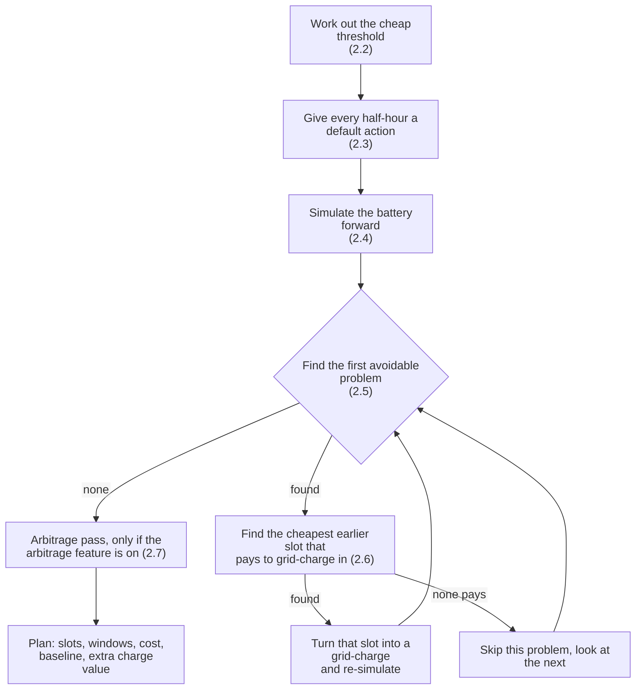
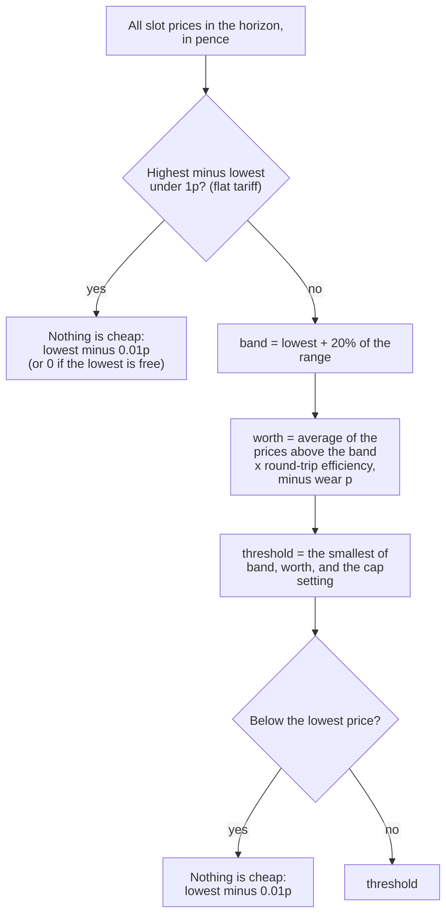
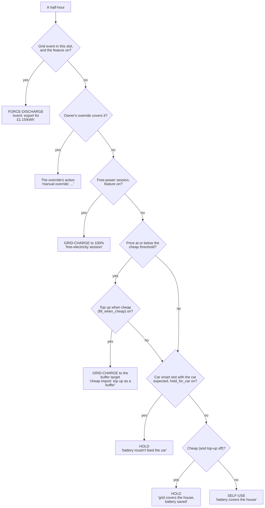
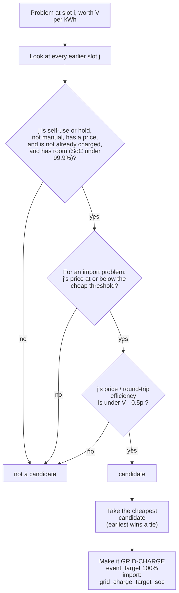

# 2. The rules planner

Code: `pe_core/planner.py` (`_rules_plan`, `_default`, `_first_problem`, `_add_arbitrage`, `step`, `simulate`),
`pe_core/tariff.py` (`cheap_threshold`).

The rules planner is the original, explainable planner. Every plan starts here. With *Optimised planning* on (the default)
it no longer chooses the actions, but it still supplies:

* the **baseline cost** ("plain self-use" over the same period, used for the "Plan saves £x" sentence);
* the **cheap threshold** the optimiser and the post-passes use;
* the **plain-English reason** for every half-hour where the optimiser agrees with it;
* the **fallback plan** if the optimiser returns nothing.

With *Optimised planning* off, this *is* the plan.

## 2.1 The three steps

At most 200 iterations (`MAX_ITERATIONS`).

## 2.2 The cheap threshold

`cheap_threshold(prices, cap_p, rte, wear_p)` in `tariff.py`. Used when the *Automatic cheap threshold* feature is on
(default); otherwise `cheap_threshold_p` (10p) is used as a fixed number.

So "cheap" means *genuinely cheap relative to the day*, *worth storing* after losses and wear, and *never above the cap*
(10p by default). Free and negative prices always count.

The planner passes `rte = efficiency squared` and the wear setting. The **live decision** (`decide.cheap_limit`) calls the
same function on a different list of prices and with the default efficiency; see
[09](09-review-findings.md#f4).

## 2.3 The default action for each half-hour

`_default(slot)`. First match wins. This is the starting point for the rules planner; the optimiser makes its own choice
from a similar menu (page 3).

**Buffer target** (`Params.buffer_target`): the grid-charge target, or the arbitrage ceiling (default 90%) when arbitrage is
on and lower. It is "top up as a buffer in case the forecast is wrong". A forecast shortfall can still charge higher (2.6).

Note the order: a cheap car slot is a **charge** (top-up on) before it is a car **hold**.

## 2.4 The battery physics, `step()`

The same function drives the rules planner, the optimiser, the post-passes and the simulator. It applies one action to one
half-hour and returns the end SoC and fills in energy flows and cost. This is the plan's model of the world.

| Action | What `step` does |
|---|---|
| **Grid-charge** | Charge at the grid-charge power (battery rate, learned taper, cold factor, **reduced so total import stays under the fuse**: house net of solar and car come first) until the slot's target SoC. House net load is covered from the same import |
| **Export** | Discharge at the lower of the battery rate and the export limit (plus house net load); capped by what is above the reserve. The battery covers the house first and sells the rest |
| **Force-discharge** (event) | Discharge at the lower of the event power and the battery rate down to the reserve; the part that reaches the grid is paid at the event rate (£1 plus export rate when on); anything beyond the battery is solar export at the normal rate |
| **Self-use** | House needs energy: the battery covers it (down to the reserve, at the discharge rate), the rest is imported. House has surplus: surplus charges the battery (charge rate, room), the rest is exported |
| **Hold** | House needs energy: imported (the battery is not used). Surplus: **exported**, not stored (the inverter is held at 0 W; fixed in 0.9.98, #175) |

Cost per slot = import kWh x price - export kWh x export price - event kWh x event rate. Efficiency is applied one way on
the way in and one way on the way out.

## 2.5 What counts as an "avoidable problem" (`_first_problem`)

Scanning forward from where it last looked:

| Kind | Condition | Value of fixing it |
|---|---|---|
| **event** (called `axle` in code) | A force-discharge slot where the battery hit the reserve and delivered less than the event power times the slot length (more than 0.01 kWh short) | The event rate per kWh (£1 + export rate) |
| **import** | A **self-use** slot where the battery is at the reserve at the end of the slot and the house imported more than 0.01 kWh, at a known price | That slot's import price |

If a problem cannot be fixed economically, the scan moves on to the slot after it.

## 2.6 Fixing a problem: where to charge

* The 0.5p is `MIN_GAIN`: a charge must save at least half a penny per kWh after losses.
* An **event** problem may charge at a price above the cheap threshold, as long as it pays against the event rate. An
  **import** problem may only charge in cheap slots.
* The reason text names what it fixes: "cheapest time (6.99p) to avoid buying at 30.28p from 17:00" or "top up for the
  event at 18:00 (charging at 6.99p to earn £1.15/kWh)".

## 2.7 The arbitrage pass (feature `arbitrage`, default off)

`_add_arbitrage`. For every cheap period that starts in the plan, walk **back** from its first half-hour through the
self-use half-hours before it, turning them into **Export**, latest first, while:

* selling beats buying back: `export price - cheap price / round-trip - wear >= minimum margin` (default 1p);
* the battery still reaches the refill with **reserve + `arbitrage_keep_soc` (10)**;
* no earlier half-hour ends up importing more than before;
* if the sale takes the battery below the arbitrage band's bottom (default 75%), it must still clear the margin after the
  band penalty (default 2p).

Any slot that is manual, an event, free-power, a car slot or has no export price stops the walk. A failing move is undone
and the walk for that refill stops.

## 2.8 Output of the rules planner

A `Plan`: per-slot action, reason, target, SoC path, flows and cost; total cost; baseline cost (plain self-use, with events
still taken); `extra_kwh` (energy left in the battery at the end compared with self-use) valued at the cheapest price in the
period (`extra_value`); the merged **windows**; and the cheap threshold used.

`saving = baseline cost - plan cost + extra_value`: leftover charge counts, so topping up is not shown as a loss.
