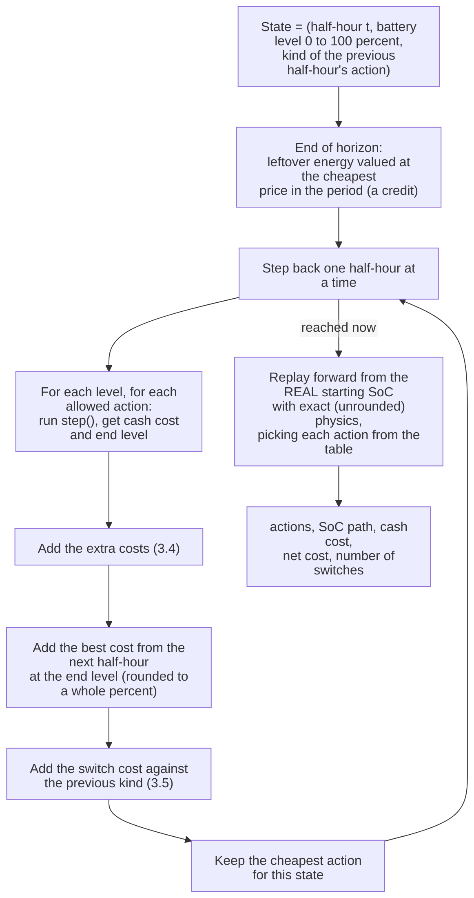
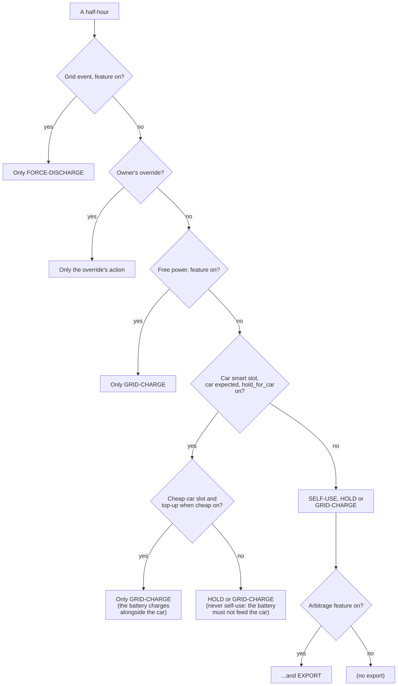
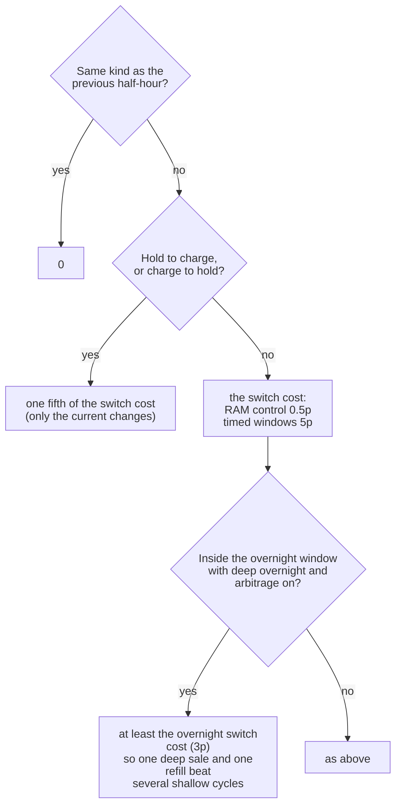
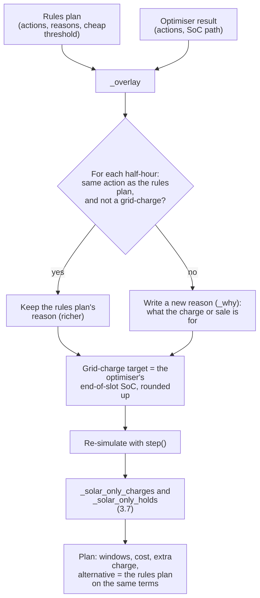
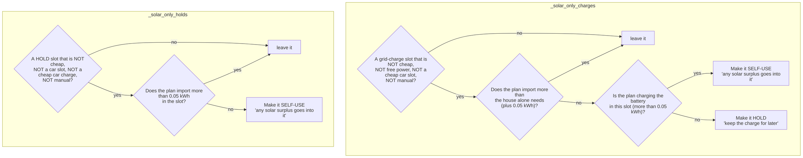

# 3. The optimiser

Code: `pe_core/optimiser.py` (`optimise`, `_actions`, `switch_cost`, `band_penalty`, `sell_floor`, `final_topup`),
`pe_core/planner.py` (`make_plan`, `_overlay`, `_solar_only_charges`, `_solar_only_holds`, `_why`).

> The module docstring of `optimiser.py` still says "for comparison only (never used for decisions)". That has been false
> since 0.7.0 (#67). By default the optimiser **chooses every half-hour's action**. See
> [09, finding F1](09-review-findings.md#f1).

## 3.1 Its job in one sentence

Find the sequence of actions over the next 36 to 48 hours that gives the **lowest total cost** under the forecast, using
exactly the same battery physics (`step`) as the rules planner, plus a handful of extra costs that stand for things money
does not capture directly (wear, inverter writes, living in the arbitrage band, ending the cheap window not full).

## 3.2 The method

It is **dynamic programming over state of charge**, solved backwards from the end of the horizon.

* The DP table is 101 levels x 4 previous-kinds x up to 96 half-hours; each cell tries up to 4 actions.
* The continuation is looked up at the end level **rounded to a whole percent** (about 0.18 kWh on an 18 kWh battery). The
  replay uses exact physics, so the reported cost and SoC are exact, but the choice rests on the rounded table.
* **Ties go to the first action tried**, in the order Self-use, Hold, Grid-charge, Export (a new action must be cheaper by
  more than 1e-9 to win).
* The four *kinds* the switch cost distinguishes: none (self-use), hold, charge, discharge (export and event).

## 3.3 What it may choose in each half-hour

`_actions(slot)`. First match wins.

A **low-write tier** (`plan_tier`) can trim these menus further. The live plan always uses tier 4 (everything allowed); the
smaller tiers are used only by the low-write shadow study (`lowwrite.py`), which changes no behaviour.

An **Export** option is also dropped if it would take the battery below `sell_floor`:

| Where | Lowest the battery may be sold down to |
|---|---|
| Inside the fixed overnight window, with *deeper selling overnight* on | reserve + `arbitrage_keep_soc` (12 + 10 = 22%) |
| Anywhere else | **5 points under** the arbitrage band's bottom (`arbitrage_min_soc` 75% - 5 = 70%), as a hard limit, because the refill there may depend on optional smart slots the supplier can withdraw. The 5 points are the soft band (3.4a); the part below 75% pays the band penalty |
| The owner's override | no floor here (the reserve in `step` still applies) |

## 3.4 What it adds to the cash cost (the "extra costs")

Cash cost comes from `step`. These extra terms steer the choice but are **not** reported as cash.

| Term | When it applies | Size | Why it exists |
|---|---|---|---|
| **Wear** | Any half-hour the battery discharges (including self-use covering the house) | `battery_wear_p` (2p) per kWh taken out | A cycle costs the battery something; discourages pointless cycling |
| **Leftover energy credit** | End of the horizon | Energy x cheapest price in the horizon | So the plan is not rewarded for emptying the battery, nor punished for ending full |
| **Band penalty** | Arbitrage on: selling below the band's bottom, or grid-charging above its top | `arbitrage_band_penalty_p` (2p) per kWh outside the band | The band is a guide, with 5 points of give each side (3.4a). Not charged for deep selling inside the overnight window |
| **Dwell above the band** | Arbitrage on: ending a half-hour above `arbitrage_max_soc` | £0.0015 per kWh per half-hour (`HIGH_DWELL`) | The full zone wears the battery; fill the top last |
| **Not full at the end of the cheap window** | The last half-hour of each overnight window run, with *top up when cheap* on, ending below `grid_charge_target_soc` | **£1.00 per kWh short** (`FULL_PENALTY`) | The battery should be full when the cheap window closes |
| **Charge early** | Grid-charge inside the overnight window | £0.0005 per kWh per half-hour of delay (`EARLY_BIAS`) | Same price all night: charge sooner, leave room for a replan |
| **Sell early** | Export | £0.0005 per kWh per half-hour of delay (`SELL_BIAS`) | A sale banked sooner is surer (a dispatch can be withdrawn, a forecast revised); a tie sells now |
| **Mid-slot stick** | The first half-hour only, when a replan runs part-way through it, and the action differs from what is running | £0.15 (`MID_SLOT_STICK`), none when forced | Near-ties flip-flopped the inverter (page 5) |
| **Switch cost** | Between half-hours whose kind differs | See 3.5 | Each change of the inverter's mode is a write |

The **final top-up** (`final_topup`): the last half-hours of each overnight window long enough to charge from the top of the
arbitrage band to the grid-charge target (plus one to spare) are allowed to charge all the way to the target. Apart from
that, free power, and the soft margin below, grid-charging does not go above `arbitrage_max_soc` with arbitrage on.

### 3.4a The soft band (0.9.102)

The arbitrage band (default 75% to 90%) used to be two hard edges in the plan: a charge stopped at the top, and a sale was
skipped if it would end under the bottom (outside the overnight window). With RAM control a sale at full power takes about
15 points off an 18 kWh battery in a half-hour, but a charge restores about 13, so every cycle needed a charge slot and a
bit, then an idle Hold for the rest of the second slot (4 Oct 2026). The band is now a guide with **5 points of give**
(`SOFT_BAND_MARGIN`), priced by the costs above:

| Edge | Before 0.9.102 | Now |
|---|---|---|
| Top: a grid charge's target (`slot_target`) | `arbitrage_max_soc` (90%) | `arbitrage_max_soc` + 5 (95%), paying the band penalty and the dwell cost for the part above 90 |
| Bottom: how low a sale may end outside the overnight window (`sell_floor`) | `arbitrage_min_soc` (75%) | `arbitrage_min_soc` - 5 (70%), paying the band penalty below 75. Still a hard floor |
| Unchanged | | The final overnight top-up and free power (to the target / 100%); a cheap car charge keeps its top-up level; deep selling inside the overnight window (reserve + 10); the reserve |

Effect measured on a synthetic night: 9 sales and two idle half-hours became 13 sales and none, with a lower net cost
(`docs/plans/soft-band.md`). Expect tighter sell, charge, sell, charge cycles and fewer Holds. The controller needed no
change: it follows each slot's `target_soc` (the plan's end level for the slot) and does not enforce the sell floor itself.
The rules planner's arbitrage pass (2.7) was not changed; it already allowed a sale below the band when it still paid after
the penalty.

## 3.5 Switch cost

`switch_cost(previous kind, new kind)`:

Timed windows pay for EEPROM wear, so a switch is dear (5p). RAM control writes volatile registers, so a switch is nearly
free (0.5p) and the plan is allowed to be choppier.

## 3.6 From the optimiser's table to "the plan"

* An owner-override half-hour keeps the rules planner's wording.
* `plan.alternative` records how much more the rules plan would cost on the same terms, and how many half-hours differ.
  It is shown on the Plan tab.
* The reason text for a grid-charge is a car-slot sentence if it is a car slot. Otherwise it looks forward through the
  later half-hours and uses the **first** one that explains the charge: a grid event ("charge at 6.99p for the event at
  18:00"), a sale ("charge at 6.99p to sell at 15p from ..."), or a self-use half-hour at a dearer price ("charge at 6.99p
  to use instead of buying at 30.28p from 17:00"). If none is found: "store it for later".
* The grid-charge target being the end-of-slot SoC is what makes the live controller "reach" a target inside every
  half-hour and hold (page 5).

## 3.7 The two clean-up passes

Both exist because the plan's *model* cannot tell two actions apart when the forecast sun covers everything, but the
*house* can, once the sun is less than forecast. They run on the optimiser's result, after the overlay.

* **Charges** (29 Sep 2026): a forced charge draws full power whatever the sun does. With less sun than forecast the shortfall
  was bought at 30.28p to sell at 15p. Self-use or Hold only ever use the surplus that is really there.
* **Holds** (4 Oct 2026): a Hold forbids the battery to cover the house. Forecast 2 kW, actual 0.4 kW, battery at 84%, house
  bought at 28.84p. Self-use draws on the battery only when the sun falls short.

The passes change the actions after the optimiser has finished; the half-hours that follow are **not** re-optimised, only
re-simulated.

## 3.8 What the optimiser does not know

* **One forecast, no uncertainty.** The solar forecast's low and high bands are read by the adapter but never used by the
  plan ([09, F6](09-review-findings.md#f6)). The only uncertainty modelled is smart-slot certainty (page 1).
* **No future replans.** It assumes the plan it makes is followed; a replan every 5 minutes corrects it.
* **House load is a profile**, not a forecast of tomorrow's weather or occupancy.
* **Prices beyond the published ones are estimated** (yesterday's), and flagged `price_estimated`.
* **Grid-charge target is not a ceiling** for its charges ([09, F2](09-review-findings.md#f2)).
* **Other devices** (second inverter, other batteries) are read only and not planned (multiple-devices plan, M1).
