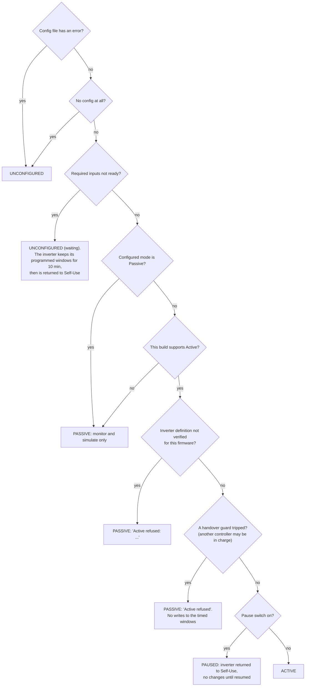
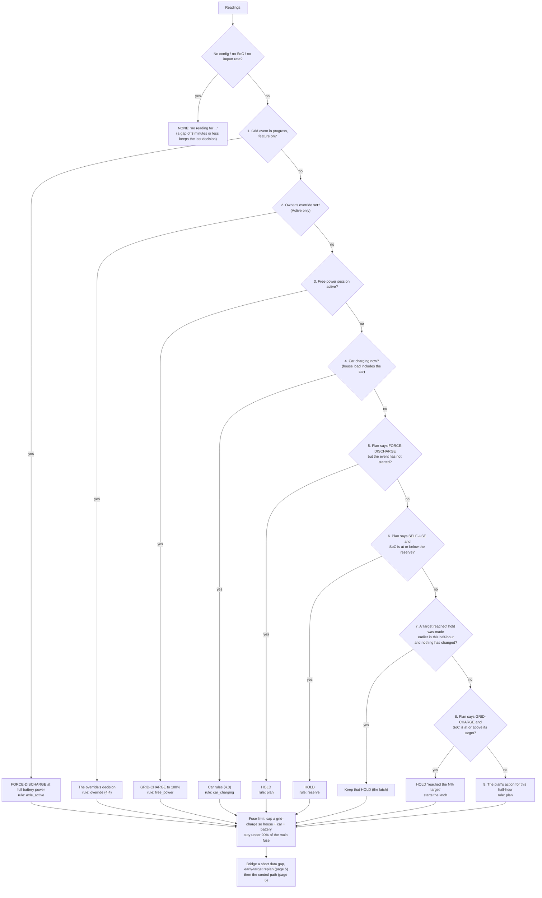
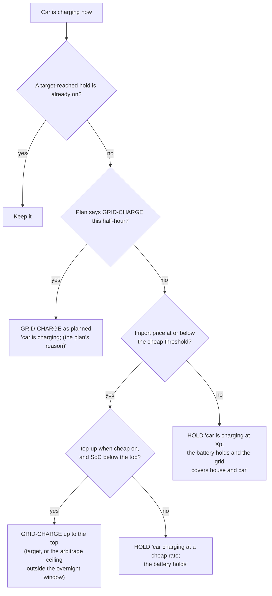
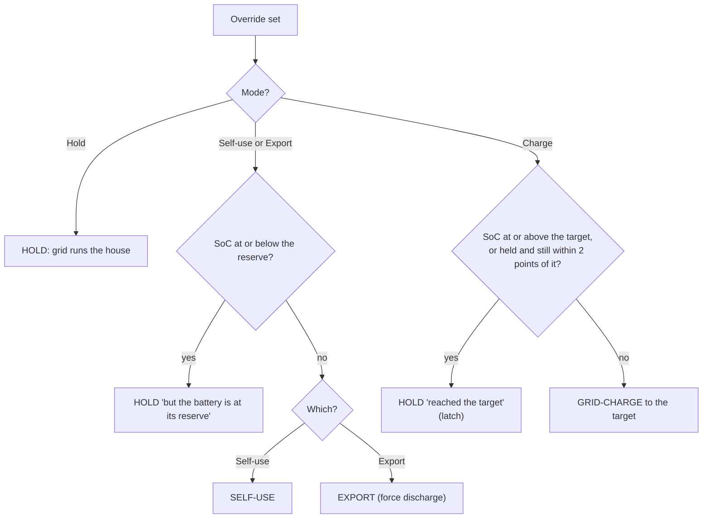
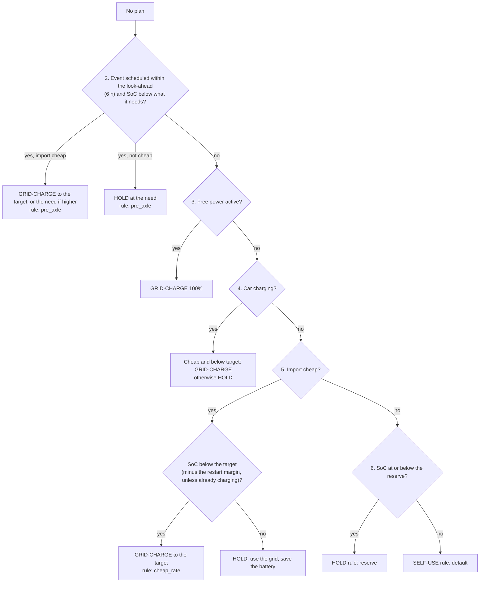

# 4. Priorities and overrides: who wins

Code: `pe_core/decide.py` (`_decide`, `_with_plan`, `fuse_limited`), `pe_core/override.py`, `pe_core/modes.py`
(`effective_mode`), `planner._default` and `optimiser._actions` (the same ordering inside the plan), and in the app
`_active_override`, `_mark_manual`, `_leave_active`.

There are **two places** where priority is decided, and they have to agree:

1. **Inside the plan**, per half-hour in the future (`_default` and `_actions`).
2. **Live**, for the half-hour running now (`decide`).

## 4.1 Which mode PowerEngine is in at all

`effective_mode` (`modes.py`). The first line that applies wins. Nothing below this is acted on unless the result is
**Active**; decisions are still *made* in Passive and Paused, they are just labelled "Would ..." and not sent.

Leaving Active hands the inverter back to Self-Use once (RAM control: remote control is switched Off, always). Going Active
(or resuming) starts a **5-minute restart hold-off** for timed-window writes (page 6).

## 4.2 The live ladder (with a plan)

`_decide` then `_with_plan`. This is what runs every 30 seconds once a plan exists, which is nearly always.

Things worth noticing:

* **Free power and the car outrank the plan, but not the owner's override.** Override is above them.
* The **reserve check (6)** applies only to a planned *Self-use*. A planned Export or Force-discharge is not checked against
  the reserve live ([09, F5](09-review-findings.md#f5)); neither is a grid event in progress (rule 1).
* The **target-reached hold (8)** comes *after* the car rule, so it does not apply while the car is charging
  ([09, F3](09-review-findings.md#f3)).

## 4.3 When the car is charging

Inside `_with_plan` (only when the house load includes the car, `house_load_includes_ev`, default on). The aim is "the
battery must never feed the car".

So with the car charging, the plan's Self-use, Export and Hold all become **Hold**. A plan that has Hold and a cheap
price becomes a charge (top-up). A 7.4 kW car charge is larger than the house load, so covering the house but not the car
was tried in 0.5.2 and dropped.

The cheap test here is the live threshold (`decide.cheap_limit`), not the plan's ([09, F4](09-review-findings.md#f4)).

## 4.4 The owner's override

Event `pe_override`, state `sensor.pe_state_override`, file `override.json`, code `override.py`.

| | |
|---|---|
| Choices | **Self-use**, **Hold** (grid runs the house), **Charge** (to the charge target), **Export** |
| Period | The running plan window; N half-hours (1 to 12); until a half-hour time (at most 12 h 30 min ahead); or permanent |
| Works in | **Active only**. In Passive or Paused it is refused/ignored (`_active_override`) |
| Sits | Below a grid event in progress, above everything else live and above the plan |
| Still applied over it | Pause, the fuse limit, the BMS limits (page 6), the RAM write budget |
| Safety inside it | Self-use and Export stop at the minimum reserve and hold. Charge holds when it reaches the target (resumes 2 points lower) |
| Not applied over it | Free power, the car rule, the "plan wants a force discharge but no event" rule. The owner chose it |

**It also changes the plan** (O3). `_mark_manual` flags every slot from now to the end of the override with the override's
action (skipping a grid-event slot, which keeps its event). Inside the plan the override sits **between a grid event and
free power**, the same order as live. The optimiser then has no choice in those slots, and plans the rest from what the
battery will hold afterwards. Setting, cancelling and expiry replan at once.

## 4.5 The same ordering, inside the plan

| Priority | Rules planner (`_default`) | Optimiser (`_actions`) | Live (`_decide`) |
|---|---|---|---|
| 1 | Grid event slot: force-discharge | Only force-discharge | Event in progress: force-discharge |
| 2 | Override slot: its action | Only its action | Override: its decision |
| 3 | Free power: grid-charge to 100% | Only grid-charge | Free power: grid-charge to 100% |
| 4 | Cheap and top-up on: grid-charge to the buffer | Choice (below) | Car charging rules |
| 5 | Car smart slot with car expected: hold | Hold or grid-charge only (grid-charge only if cheap and top-up on) | Plan's action |
| 6 | Cheap: hold | Choice | Plan's action |
| 7 | Otherwise self-use | Choice among self-use, hold, grid-charge (and export if arbitrage) | Plan's action |

The three agree on the first three rungs. Below that, the plan assumes **no car except the running half-hour while the car is
charging** (0.9.103) and live reacts to the actual car. A change in the car's state remakes the plan, so the two stay close.

## 4.6 When there is no plan (fallback ladder)

If `plan` is `None` (just after a start, or planning failed) `_decide` falls through to a **reactive rule stack**. Rules 1
and the override are as above; then:

**Need for an event** (`pre_axle_reserve`): `reserve + (event power x event hours / capacity x 100) + event margin`, capped
at 100%.

The settings `pre_axle_lookahead_h` (look-ahead), `axle_margin_soc` (margin) and `charge_hysteresis_soc` (restart margin)
are read **only** by this fallback. With a plan they have no effect ([09, F1b](09-review-findings.md#f1b)).

## 4.7 Conflict cheat-sheet

| Situation | What happens | Where |
|---|---|---|
| Grid event active, and an override | Event (override resumes after) | 4.2 rung 1 |
| Grid event active, and the car charging | Event (force-discharge) | rung 1 comes first |
| Grid event active, and the pause switch on | Paused: nothing is sent | 4.1 |
| Override, and a free-power session | Override | override is above free power |
| Override, and the car charging | Override. A Self-use or Export override can feed the car | no car check in `override.decide` |
| Free power, and the car charging | Grid-charge to 100% | rung 3 before 4 |
| Plan says Export, car charging | Hold | 4.3 |
| Plan says Self-use, car charging, import cheap, top-up on | Grid-charge up to the top | 4.3 |
| Plan says Self-use, battery at reserve | Hold | rung 6 |
| Plan says Force-discharge, event not yet active | Hold | rung 5 |
| Plan says Grid-charge, target reached, car not charging | Hold for the rest of the half-hour; replan if 5+ min left | page 5 |
| Plan says Grid-charge, target reached, car charging | Still Grid-charge | F3 |
| Any grid-charge, and the fuse near its limit | Charging power is cut to the room left | fuse limit |
| Any command, BMS says the battery can take less | Capped to the BMS limit (0 means Hold or Off) | page 6 |
