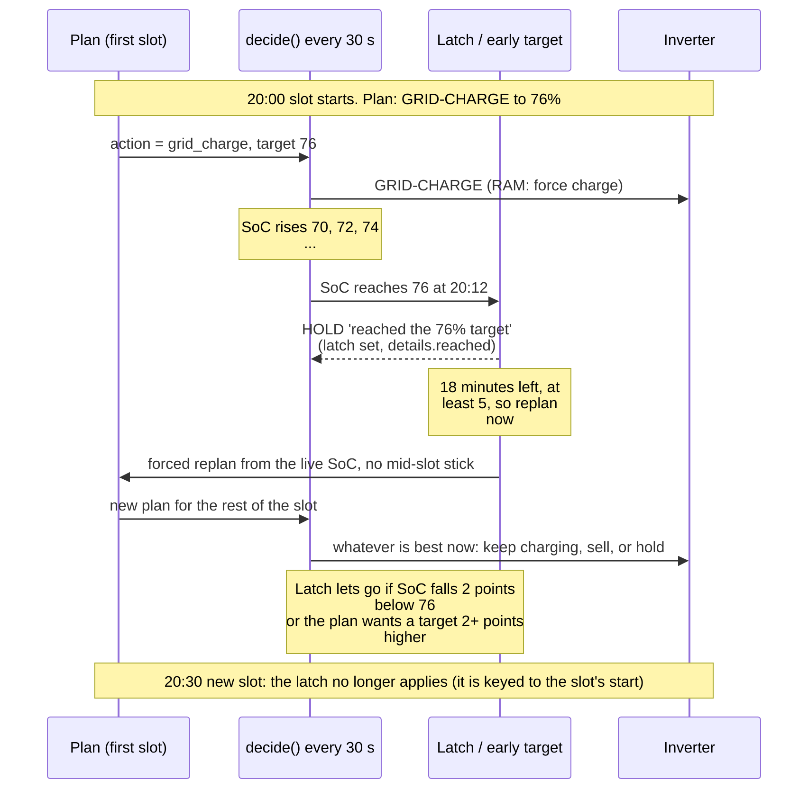
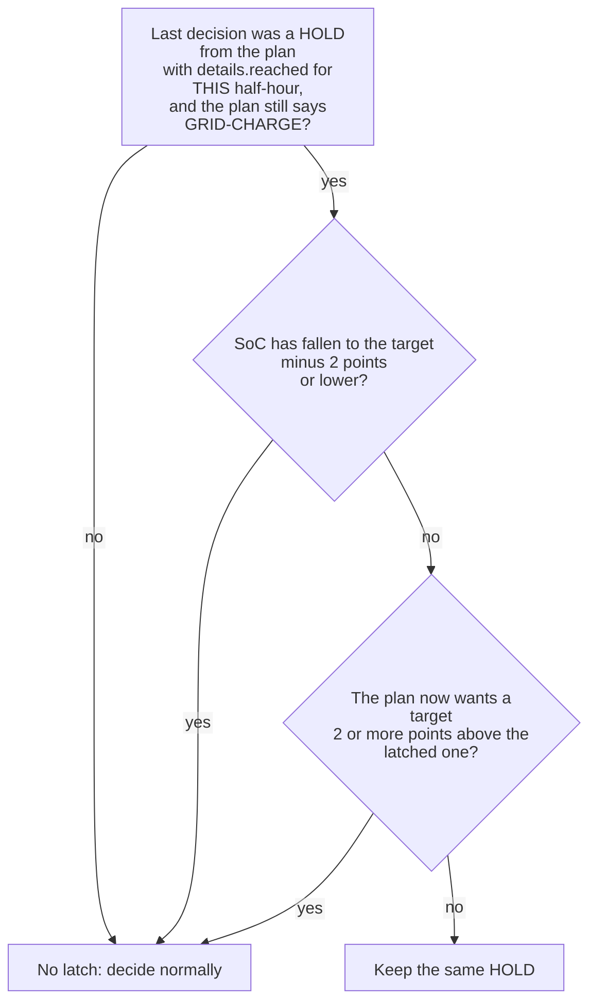
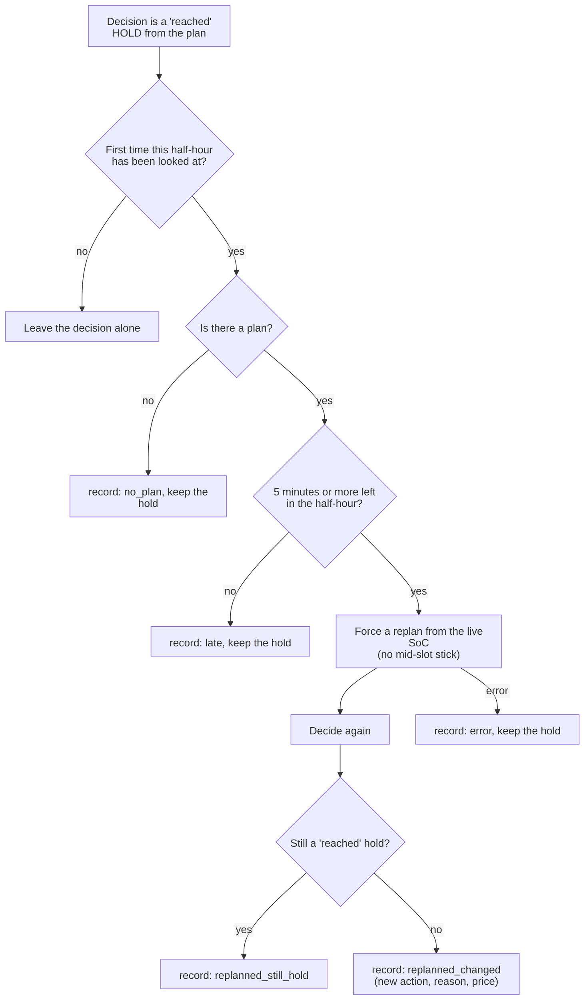

# 5. From plan to decision: the live step

Code: `pe_core/decide.py` (`_with_plan`, `_held_at_target`, `_run_destination`), `pe_core/earlytarget.py`, and in the app
`_cycle`, `_maybe_replan`, `_first_slot_hours`, `_mid_slot_stick`, `_early_target`, `_bridge_data_gap`.

The plan covers the next 36 to 48 hours. The controller only ever acts on **the first half-hour of it**, re-read every 30
seconds against live readings. This page covers what sits between those two: how a half-hour plays out, and the four
mechanisms that stop the inverter being pushed around by small differences between plan and reality.

## 5.1 One half-hour, as the controller sees it

## 5.2 The target latch

`_held_at_target`. Problem it solves: the inverter's SoC reads a **point lower while charging than while holding** (93
charging, 94 holding). With a charge target of 94, the controller reached 94, held, saw 93, charged, saw 94 ... flipping
between Force charge and Hold every 30 seconds (29 Sep 2026, 22:38 to 22:44 and twice more).

* `LATCH_BAND_SOC` = 2 points.
* It is keyed to the slot's **start time**, so it cannot leak into the next half-hour.
* The same 2-point band is used for the owner's Charge override (`override.py`).
* `Decision.details["reached"]` carries it; nothing else may use `details` for another purpose without care.

## 5.3 The reached-target hold

If the plan says GRID-CHARGE and SoC is at or above its target, the decision is **HOLD** ("reached the N% charge target for
this half-hour: holding until the next one") and the latch starts. Without it the inverter kept charging past the target
(RAM control: 63% to 82% against a 76% target, 28 Sep 2026), because a force charge has no target of its own.

The grid-charge target is the optimiser's **end-of-slot SoC**, so the target is normally reached right at the end of the
half-hour, and this mostly matters when charging runs faster than modelled.

## 5.4 The early-target replan (#175)

`_early_target`, `earlytarget.py`. A hold at the target for the rest of the half-hour used to waste the remaining minutes:
the best action (carry on charging, start the next slot's sale early) was available, but the plan had not been asked.

* One look per half-hour, so it cannot loop.
* Every look is a record in `early_target.json` (last 300), including the next slot's action and price, whether the car was
  charging, and the decisions that followed in the rest of the half-hour (up to 4) so churn can be seen. The diagnostics
  export carries the summary and the last 60.
* **Review due about 11 Oct 2026** (CLAUDE.md): how often it fires, what it chose, minutes of hold avoided, extra energy
  sold or charged, churn, and the `late` / `still_hold` cases.
* Not done: the same idea for holds that are not at a charge target.

## 5.5 Replanning part-way through a half-hour

Two mechanisms in the replan (`_maybe_replan`) exist so a plan made at 20:17 makes sense:

| Mechanism | What it does | Constant |
|---|---|---|
| **Partial first slot** (`first_h`) | The first slot is planned for the **rest** of the half-hour only: its load, solar, cost and end SoC are for that part | at least 1 minute, so a plan made just before the boundary stays sensible |
| **Mid-slot stick** | A replan does not change the running half-hour's action unless that saves more than the stick amount | £0.15 (`MID_SLOT_STICK`). Applies only after the first 2 minutes of a half-hour (when the plan's next half-hour takes over). Not applied for a forced (early-target) replan. Not applied after a start, until the half-hour in which the 5-minute warm-up (`STICK_WARMUP`) ends has finished: the first plans use a default load profile and no weather, so their choice is not worth keeping |

## 5.6 Short missing readings

`_bridge_data_gap`. If a reading goes missing for a cycle (the import rate went unavailable for one cycle on 4 Oct 2026,
08:21), `decide` returns `no_data`. Without bridging that handed the inverter to Self-use and straight back: two RAM writes
for nothing.

* A `no_data` decision within **180 seconds** (`DATA_GAP_GRACE_S`) of the last real one keeps that decision.
* No earlier real decision, or a longer gap: `no_data` is used as before.
* Separate from this: if **required inputs** stay missing 10 minutes (`INPUT_GRACE_SECONDS`), the inverter is returned to
  Self-Use ([04](04-priorities.md), 4.1).

## 5.7 How a decision is worded

* `Decision.sentence(passive)`: "Grid-charge to 80%: cheap import ..." or "Would grid-charge ..." in Passive.
* For a grid-charge the sentence shows `label_target_soc`: where the plan's **run** of consecutive grid-charge slots ends up
  (`_run_destination`), not the current slot's own target; the control keeps using the slot's own target.
* The reason text comes from the plan; prices named in it are the ones the decision used. A planned smart slot not yet
  priced shows "tariff still 30.28p" rather than naming a peak price as the slot price (29 Sep 2026).
* `ModeDecision.label` ("waiting for inputs") is for logs; `effective == "unconfigured"` stays the key the entity, the card
  and code use.
* The activity log gets a new entry only when the action, the deciding rule, or a charge's destination level changes.
