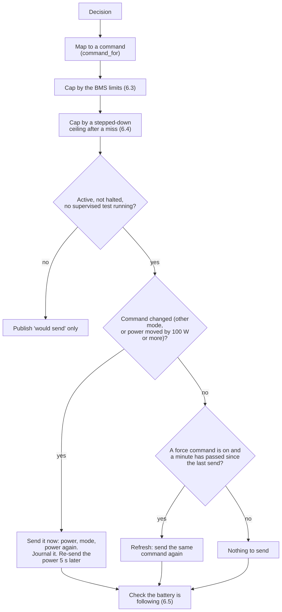
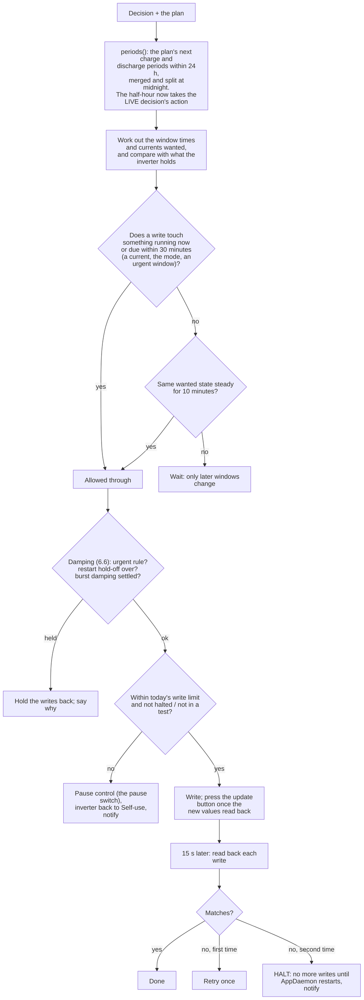
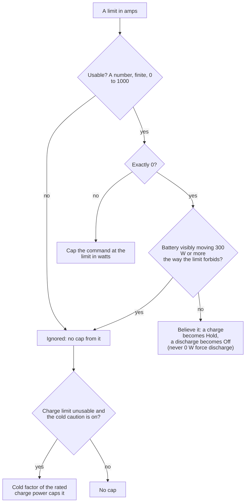
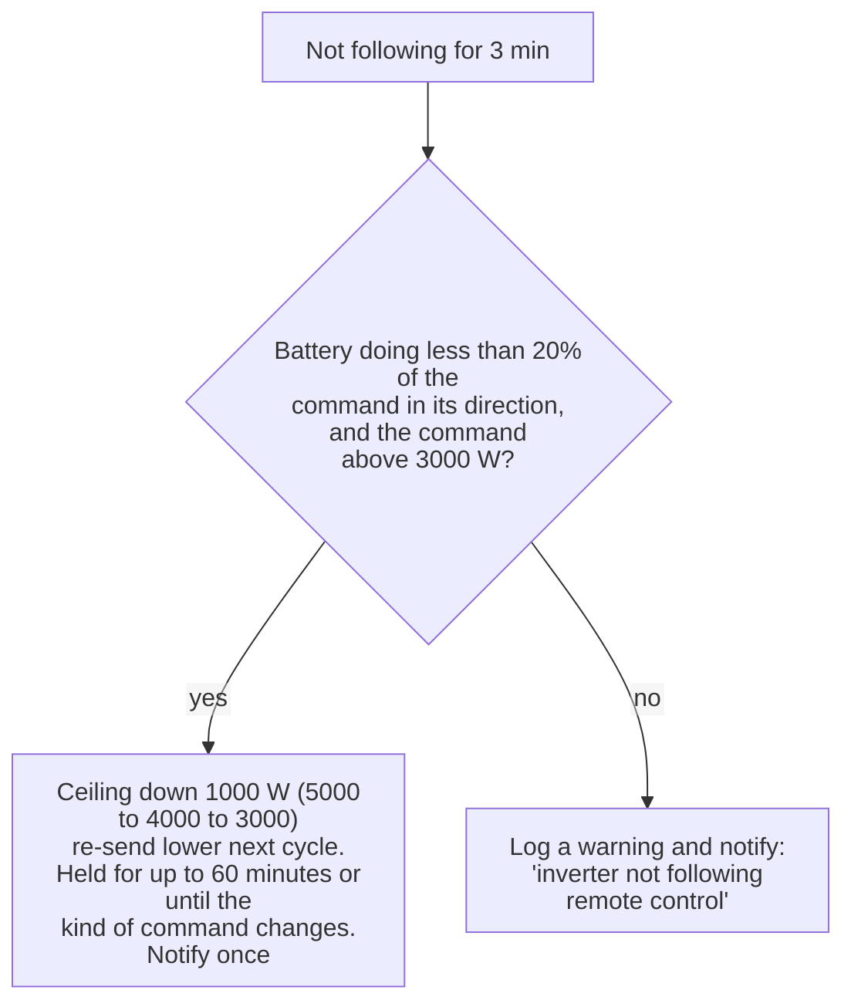

# 6. From decision to inverter

Code: in the app `_control`, `_control_ram`, `_control_slots`, `_write`, `_execute`, `_verify_writes`,
`_within_write_limit`, `_bms_limits`, `_ram_step_down`, `_leave_active`, `_release`; in `pe_core`: `ramcontrol.py`,
`bms.py`, `control.py`, `schedule.py`, `damping.py`, `rctest.py`, and the inverter definition
(`adapters/devices/solis.yml`, `adapters/defined.py`).

A **Decision** is an abstract action (`self_use`, `hold`, `grid_charge`, `export`, `force_discharge`) plus a target and
sometimes a power. This page is how it becomes commands. Two control methods exist (system setting `control_method`):

| | **RAM remote control** (this install's default) | **Timed windows** |
|---|---|---|
| What is written | The remote-control registers (43135 mode, 43136 charge W, 43129 discharge W) through SolaX Modbus "Battery control override" | The inverter's three charge and three discharge timed windows, their currents, and the update button |
| Memory | Volatile: the inverter drops it and returns to Self-use about **5 minutes** after it stops being sent | EEPROM: counted, limited, precious |
| Failsafe | Built in: if PowerEngine, AppDaemon or HA stops, the inverter is back on Self-use within about 5 minutes | The programmed windows keep running; the HA watchdog automation closes them after 15 minutes |
| Plan's switch cost | 0.5p | 5p |
| Write budget (`max_writes_per_day`) | Not applied (nothing is EEPROM) | Applied: control pauses at the limit |
| Falls back if | The remote-control entities cannot be found: timed windows are used, a notification is sent | |

Active only. In Passive the same result is computed and published as "would send" so it can be checked first.

## 6.1 RAM remote control, step by step

**Decision to command** (`ramcontrol.command_for`; the caps are `ram_max_power_w` (5000 W) and the battery's own limits):

| Decision | Command | Power |
|---|---|---|
| Grid-charge | Force charge | The decision's power (fuse-limited) or the battery's maximum charge rate |
| Hold | Force charge at **0 W** (the battery neither charges nor discharges) | 0 |
| Export, Force-discharge | Force discharge | The decision's power or the battery's maximum discharge rate |
| Self-use | **Off** (the inverter's own Self-use) | none |
| None | Off | none |

* The first time RAM control takes over, the timed windows are closed once and then left alone (no EEPROM writes).
* Changes are journalled with a reason. Refreshes are not.
* A power written just before or with the mode change does not take on some firmware, so a change sends the power, then the
  mode, then the power again, and once more 5 seconds later.
* Leaving Active (pause, Passive, inputs gone) always sends remote control **Off**.

## 6.2 Timed windows, step by step

* Windows cannot cross midnight, so a period over midnight takes two windows. Charge windows share one current (Hold =
  0 A), discharge windows another.
* A window is rewritten only when its period has passed and the slot is needed for another, or when the plan moves it by
  more than 30 minutes; periods starting within 2 hours are set exactly.
* If the single rolling window is used instead (windows 2 and 3 not found), the window is at most 35 minutes ahead and
  extended as it nears its end, so a stopped PowerEngine leaves nothing running for long.
* The update button is pressed only after the staged values read back (it can otherwise send the old ones).
* A **forbidden** entity (any with "bump" or "boost" in its name; Backup or Off-Grid modes) is never written. The app
  enforces it in `_write` as well as the definition.

## 6.3 BMS limits

`bms.py`. Optional sensors (`battery_bms_charge_limit`, `battery_bms_discharge_limit`) give the battery's own current limit
in amps; amps x 52 V (`BATTERY_VOLTS`, rounded down to 100 W) gives watts.

## 6.4 Following check and step-down

After a change there is **90 seconds** of grace. Then:

| Command | "Following" means |
|---|---|
| Hold (force charge 0 W) | Battery not discharging more than 300 W |
| Force charge | SoC at 95% or above, or expected power under 300 W, or charging at 50% or more of the expected power |
| Force discharge | SoC within 5 points of the reserve, or expected under 300 W, or discharging at 50% or more of the expected |

The **expected** power is the command, lowered to the BMS limit, and for a discharge lowered to what the inverter can still
put out (its total AC limit, `inverter_max_output_w` 6000 W, less the solar passing through it).

Not following for **3 minutes** is an alarm. First the controller tries to fix it:

A battery doing *some* of it is limited by itself (BMS, taper); a refused write leaves the previous power, so the battery is
idle or going the other way.

## 6.5 Fuse limit

`fuse_limited`: after the decision is made, a **grid-charge** is cut so house net load + car + battery charge stay under 90%
of the main fuse (`main_fuse_a` x 230 V x 0.9). The battery is reduced first. The sentence gains "(charging limited to 2.1 kW
by the 60 A fuse)". The plan models the same limit (`grid_charge_kw`), so the live cut should be small.

## 6.6 Dampening (timed windows only)

`damping.py`, settings under *Dampening tuning*:

* **Restart hold-off** (on): for 5 minutes after PowerEngine starts, resumes, or goes Active, nothing is written. Straight
  after a restart the inputs are still settling and the inverter is still running the windows already set.
* **Burst damping** (off, being evaluated): a second change to a slot, current or the mode within 10 minutes of the
  last waits until the wanted state has been steady for 5 minutes.
* Never delayed: the **urgent rules** `axle_active`, `pre_axle`, `free_power`, `car_charging`, `reserve`; and pausing or
  leaving Active.
* Three shadow inverters run alongside (none / restart / both) and count what each would have written, for the Health tab.

## 6.7 Safety rails

| Rail | Where | Effect |
|---|---|---|
| Never write Backup or Off-Grid, or any "bump"/"boost" entity | `_write`, definition | Refused |
| Active, Passive, Pause belong to the owner | `modes.py` | PowerEngine never changes them (except the daily write limit, which sets Pause) |
| Unverified definition or firmware | `verification.active_refusal` | Active refused: effective Passive |
| Another controller in charge | handover guards | Active refused; no window writes |
| Daily write limit (timed windows) | `_within_write_limit` | Pause, Self-use, notify |
| Read-back mismatch twice | `_verify_writes` | Halt until restart, notify |
| Supervised test running | `_test_running` | Normal control stands aside |
| A site/inverter change | `_site_guard` | Switch to Passive, flag a retest |
| Attributes under 16 KB | `_publish_state` | Warning above 15,000 bytes |
