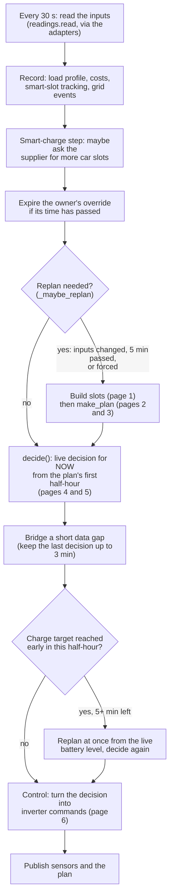
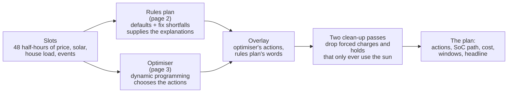

# How PowerEngine decides: the plan logic, written down

> **Status:** written 5 Oct 2026 from the code at 0.9.100, refreshed for 0.9.101 to 0.9.104 (car idle blip, soft arbitrage band, the plan no longer waits for the car, smart slot used = unbroken charging time) and for the overnight window setting (built for 0.9.105, not released yet). It describes what the code does, not what
> it was meant to do. Where the two differ, [09-review-findings.md](09-review-findings.md) says so. Nothing in the code was
> changed to write these pages.
>
> **Keeping it true:** a PR that changes planner, optimiser, `decide`, the override or the control path updates the matching
> page here (and the decision log, [08](08-decision-log.md), if it adds a rule). Code is cited by file and function name,
> not line number, because line numbers drift.
>
> **Diagrams:** every Mermaid block starts with the same `%%{init: ...}%%` line (plain SVG text, extra padding). Without it,
> Mermaid measures each label in one font and clips it to that box, so in a viewer with a different font the text is cut off
> at any zoom. Copy the line into any new diagram; `tests/test_logic_docs.py` checks it.

These pages are for the owner to read and review: what PowerEngine considers, in what order, and why. The diagrams are
[Mermaid](https://mermaid.js.org/) (GitHub draws them; in an editor they read as indented text). Where a decision has many
parallel rules there is a table instead of a flowchart, because a flowchart of twelve side-by-side conditions is harder to
check than twelve rows.

## The pages

| # | Page | The question it answers |
|---|---|---|
| 0 | this page | What runs when, from the readings to the inverter command |
| 1 | [Inputs and certainty](01-inputs.md) | What does the plan know, and how sure is it? Prices, smart slots, grid events, solar, house load, learned limits |
| 2 | [The rules planner](02-rules-planner.md) | The explainable first draft: each half-hour's default action, then the "fix the first shortfall" loop |
| 3 | [The optimiser](03-optimiser.md) | The part that actually chooses the actions: what it minimises, what it penalises, what it may do in each half-hour |
| 4 | [Priorities and overrides](04-priorities.md) | When two things want different actions, which wins: grid event, owner override, free power, car, plan |
| 5 | [From plan to decision](05-plan-to-decision.md) | The live 30-second step: the target latch, early-target replan, reserve, fuse, data gaps |
| 6 | [From decision to inverter](06-to-inverter.md) | RAM remote control and timed windows, write budget, damping, BMS limits, follow checks |
| 7 | [Settings that touch the plan](07-settings.md) | Every setting and feature switch, where it acts, and the ones that currently act nowhere |
| 8 | [Decision log](08-decision-log.md) | Each rule that exists because of something that went wrong or something the owner decided, with the date |
| 9 | [Review findings](09-review-findings.md) | Where the code and its comments disagree, rules that look redundant or in tension, and questions for the owner |

If you only read three: this page, [04](04-priorities.md) (who wins) and [09](09-review-findings.md) (what to look at).

## The whole pipeline in one picture

Everything below happens in `PowerEngine._cycle` (`apps/powerengine/powerengine.py`), every **30 seconds**
(`CYCLE_SECONDS`). The plan is remade at most every **5 minutes** (`REPLAN_SECONDS`) or sooner when something that matters
changes. The decision is made on **every** cycle from the plan's first half-hour plus live readings.

### What "the plan" is, in three layers

* The **rules plan** is always built. With *Optimised planning* switched off (feature `optimised_plan`, default **on**) it
  *is* the plan, and the optimiser runs only to produce a comparison figure on the Plan tab.
* With it on (the default, since 0.7.0), the **optimiser chooses every half-hour's action** and the rules plan is used for
  the baseline cost, the cheap-price threshold, and the plain-English reason where both agree.
* The post-passes (`_solar_only_charges`, `_solar_only_holds`) edit the result; they do not re-run the optimiser.

### What "the decision" is

The plan says what each half-hour *should* be. The decision is what the controller does *right now*. Usually they are the
same, but the decision can differ from the plan for these reasons, in this order (full detail in
[04](04-priorities.md) and [05](05-plan-to-decision.md)):

1. a **grid event is in progress** (force discharge, always wins);
2. the owner's **manual override** is set (Active only);
3. a **free-electricity session** is on;
4. the **car is charging** (the battery must never feed the car);
5. the plan wants a force discharge for a grid event that **has not started** (hold instead);
6. the plan wants **Self-use but the battery is at its reserve** (hold);
7. the half-hour's **charge target was already reached** (hold for the rest of the half-hour);
8. otherwise the plan's action for this half-hour;
9. afterwards, whatever was chosen is capped by the **fuse limit**, then by the battery's **BMS limits**, and the write
   budget, damping and follow checks apply on the way to the inverter.

### Vocabulary

| Word | Meaning here |
|---|---|
| Slot | One half-hour (`forecast.Slot`): price, export price, forecast solar, expected house load, and flags (smart slot, grid event, free power, overnight, manual) |
| Action | One of `self_use`, `hold`, `grid_charge`, `export`, `force_discharge` (`decide.py` constants) |
| Self-use | The battery covers the house; surplus solar charges it |
| Hold | The grid runs the house, the battery is kept. On the inverter this is "force charge at 0 W" |
| Grid-charge | Force-charge from the grid towards a target SoC |
| Export | Sell from the battery (arbitrage, or the owner's override) |
| Force-discharge | A grid event (Axle): discharge at full power into the event |
| Cheap | A price at or below the *cheap threshold* (page 2). Not a fixed number: it is worked out from the day's prices |
| Smart slot | A half-hour the supplier has planned for the car at the cheap rate, for the whole house |
| Overnight window | The half-hours that are the cheapest rate on *every* day seen so far (the tariff's fixed cheap window) |
| Target | The SoC a grid-charge heads for in a given half-hour |
| Reserve | `min_reserve_soc` (default 12%): the plan never goes below it |
| Latch | A hold that stays on for the rest of the half-hour once a charge target is reached |
