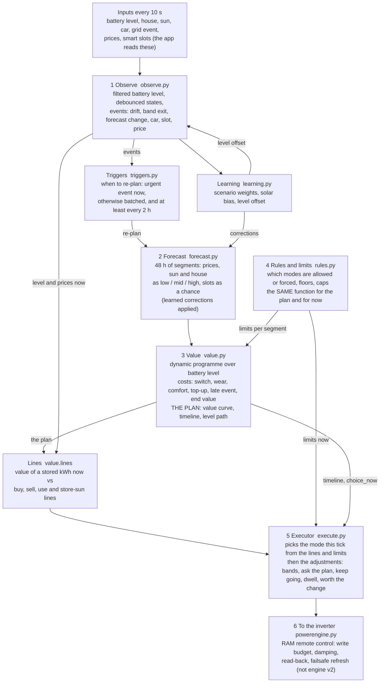
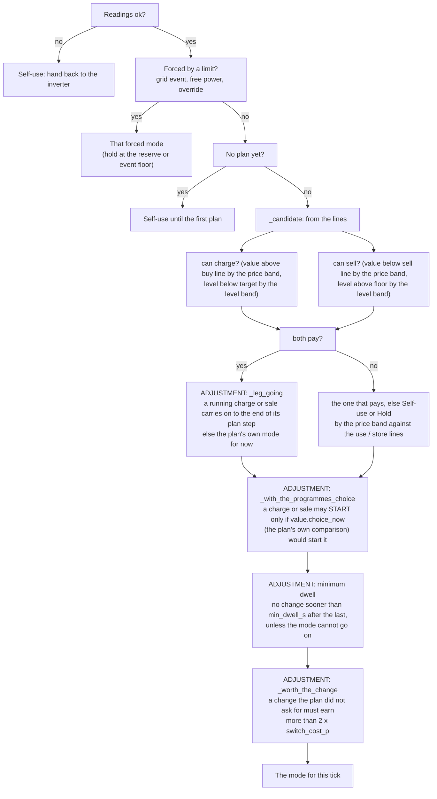

# Engine v2: how it is built, what runs where, and where each setting applies

10 Oct 2026 · the reference the ablation write-ups ([1](engine-v2-ablation-1.md), [2](engine-v2-ablation-2.md),
[3](engine-v2-ablation-3.md)) rest on. Written from the code (`apps/powerengine/pe_core/engine_v2/`), not from the design plan, so it
says what the engine does now. `engine-v2.md` is the design; where they differ, this page and the code are right.

## The one idea

Engine v2 does two different jobs, and most confusion comes from mixing them up.

1. **The model** works out, for the next 48 hours, *what a stored kWh is worth* at every battery level and every half-hour, given
   the prices, the sun, the house, the smart slots and the grid events. That is a dynamic program: it is solved backwards from the
   end of the 48 hours. It runs only now and then (a few dozen times a day, about a second each), not every tick. Its
   output is the **plan**: a table of values (`lam`), an expected timeline of modes, and an expected level path.
2. **The live read** runs every 10 seconds. It reads the battery level and the price now, looks up what a stored kWh is worth at
   that level in the current plan, compares it with the real prices (the "lines"), and picks the mode. On top of that sits a stack of
   **adjustments** (hysteresis, minimum times, "ask the plan again") that stop the live read from changing its mind too often.

The model is the engine's *judgement*. The adjustments are the engine's *manners*. The simulator's ablations switch the manners off
one at a time to see what each is worth; the model and the hard limits are not touched.

## Architecture

Read it as two loops:

- **The slow loop** (top, left to right): events arrive, the triggers decide a new plan is needed, the forecast is rebuilt, the
  value is solved. This is the *model*.
- **The fast loop** (every tick): the level and prices now are compared with the plan's values (the lines), the limits are
  applied, and the executor picks a mode. This is the *live read plus adjustments*.

The hard limits (`rules.py`) are one function used by both loops, so the plan and the live decision cannot disagree about what is
allowed.

## What is the model, and what is an adjustment

| Part | Where | What it is | Examples |
|---|---|---|---|
| **Model** | `forecast.py`, `value.py` | What is worth doing: it prices every option over 48 hours and every battery level. | prices, sun scenarios, wear, comfort band, top-up cost, late-event chance, end-of-horizon value, **switch cost inside the plan** |
| **Hard limits** | `rules.py` | What is allowed or forced. Facts and safety, not tuning. Used by the plan and by the live decision. | grid event, free power, manual override, car charging, reserve and hard floor, charge ceiling, BMS / fuse / cold caps |
| **Live read** | `value.lines`, `execute.py` | Turns the plan into this tick's mode by comparing real prices with the value of a stored kWh at the level now. | the buy / sell / use / store-sun lines |
| **Adjustments** | `execute.py` | Rules on top of the live read to stop it flickering. They are *not* in the plan: the plan does not know they exist. | price band, level band, minimum dwell, "keep a running charge going", "ask the plan before a charge or sale", "a change must pay for itself" |
| **When to re-plan** | `observe.py`, `triggers.py` | Decides when the model runs again. | drift, band exit, forecast change, batch window, backstop |
| **Data hygiene** | `observe.py` | Makes readings fit to act on. | debounces, stale-reading grace, the battery level filter |
| **Learning** | `learning.py` | Corrections that feed the forecast and the filter. | scenario weights, solar bias, level offset |

The tension at the heart of the ablation results: **the plan is calm by construction** (it adds a price for every change of mode,
so it rarely proposes one), but **the live read compares one step at a time**, so near a price line it can flip every few seconds.
The adjustments exist to close that gap. Switch them all off and the live read follows the prices exactly and chatters (1,743 mode
changes in three days, ablation 2). Put back only "ask the plan" and it falls to 127, because that adjustment hands the decision back
to the plan itself.

## What happens in one tick (every 10 seconds)

1. The app reads the inputs and hands them to the engine (`_engine_tick`).
2. **Observe**: the battery level is filtered (energy counted, nudged toward the reading); readings are debounced; events are
   raised if something changed (a price boundary, a slot, a car start, drift from the forecast, the level leaving its expected range).
3. **Triggers**: if an event wants a new plan (and is urgent, or has waited the batch window, or the plan is two hours old), the
   engine re-plans now (see below).
4. **Lines**: from the current plan, the value of a stored kWh at this level and time is read out and set against the live import and
   export prices, after losses and wear (formulas below).
5. **Limits now**: `rules.limits_now` says which modes are allowed or forced right now.
6. **Executor**: picks the mode (flow below).
7. The decision goes to the app, which sends it to the inverter under the write budget (not part of engine v2).

## What happens in one re-plan (a few dozen a day)

1. `forecast.build` cuts the next 48 hours into segments (no longer than `max_segment_min`) and attaches prices, events, the car and
   a low / mid / high figure for the sun and the house, with learned corrections applied. A smart slot is one *expected* price
   (its chance times the slot price plus the rest times the normal price), so the plan cannot count on a slot to refill what it sells.
2. `value.solve` runs the dynamic programme backwards over the segments and over battery levels (grid of `level_step_kwh`), against
   three net-load scenarios. For each level and segment it chooses the cheapest of Self-use, Hold, Charge and Export (with a partial
   charge or sale allowed), adding the **switch cost** whenever the mode changes from the previous segment, the wear, comfort and
   top-up costs, and (for unannounced grid events) the late-event chance. The end of the 48 hours is valued by `terminal_value`.
3. From the solved values it builds the plan: the value curve `lam[k][i]` (pence per stored kWh at segment k, level i), the expected
   **timeline** of modes with levels and reasons, and the expected level **path** (mid, low and high).

## The lines (how the live read compares)

At level `L` and live prices, with `value` = what a stored kWh is worth now from the plan:

| Line | Formula | Meaning |
|---|---|---|
| buy | import / charge efficiency (+ top-up cost above the comfort band's top) | Charging pays while `value` > buy line |
| sell | export x discharge efficiency - `wear_sale_p` | Selling pays while `value` < sell line |
| use | import x discharge efficiency - `wear_house_p` | The battery should cover the house while `value` < use line |
| store sun | export / charge efficiency | Spare sun should be stored while `value` > store line |

When the value is above the buy line the live read wants to **charge**; below the sell line, to **sell**; between the lines it wants
Self-use or Hold. As the battery fills, `value` falls; as it empties, `value` rises. That is why the plan needs no separate "target
level" rules.

## The executor's decision, and where each adjustment sits

The boxes marked ADJUSTMENT are the "adjustments" of the earlier table. Notes:

- `price_band_p` and `level_band_pct` live inside `_candidate` and its helpers: they widen the margin to *start* a mode and narrow
  it to *stay* in one. `price_band_p` is not in the plan's own cost; `switch_cost_p` is.
- "ask the plan" (`_with_the_programmes_choice`) is the one adjustment that calls back into the model: `value.choice_now` is the plan's
  own backward-pass choice (same candidates, same switch cost), so the live decision cannot disagree with the plan about a charge
  or sale that only looks good one step at a time.
- Safety events (a limit forcing a mode, urgent events) skip the dwell and the worth-the-change test.
- Not shown: after a mode is picked, the engine also watches for a **deadline** (a charge or sale that outruns the plan's expected end
  by `deadline_grace_min` asks for a new plan) and keeps a short flip-flop memory for its health sensor. Neither changes the pick.

## How the simulator touches each part

| What the simulator changes | How | Parts it reaches |
|---|---|---|
| An engine setting | Put into the config's `engine_v2:` block, read by the real app | Anything in the tables below |
| A module constant | `setattr` before the run | The tuning with no setting (`COARSE_STEP_KWH`, `LEVEL_EPS` and so on) |
| An executor rule that is code | The method is replaced by a neutral stub (`@false`, `@true`, `@pass`) | `_leg_going`, `_with_the_programmes_choice`, `_worth_the_change` |

Nothing in the repo's engine code changes. A setting set to "off" in the GUI is the same as the config page setting it to that value.

## Every setting, what it does, and where it is applied

Kinds: **MODEL** changes what the plan thinks is worth doing; **LIMIT** a hard rule shared by plan and live decision; **LIVE** an
adjustment applied only in the executor, after the plan; **MODEL + LIVE** both; **WHEN** decides when to re-plan; **DATA**
filters readings; **LEARN** learns a correction that feeds the forecast or filter; **APP** is not part of how the engine decides.
"Your config" shows the values in your archived config that differ from the default (all other settings are at their defaults).

### What engine v2 may do

| Setting | Default | Your config | Kind | Where it is applied | What it does |
|---|---|---|---|---|---|
| `arbitrage` | off |  | LIMIT | rules.py | Whether Export is a mode at all. Off: the plan and the live decision can never sell for profit; only grid events sell. |
| `events` | on |  | LIMIT | rules.py, forecast.py, value.py | Whether grid events are acted on. On: a running event forces the Event mode (sell to the floor); the plan prices known events and the late-event chance. |
| `late_events` | on |  | MODEL | value.py `_late_events` | Treats every future unforced stretch as having a small chance that an unannounced grid event is running. That makes a stored kWh worth more in the plan (a full battery would be sold at the event rate), so the plan fills up at the end of a cheap window and keeps more. |
| `late_events_per_week` | 1.5 per week |  | MODEL | value.py | How often such events are expected. With the hours below it sets the chance (about events/week / 7 x hours / 24). 0 turns late events off. |
| `late_event_hours` | 1.0 h |  | MODEL | value.py | How long each late event is assumed to last. |
| `event_plus_export` | on |  | MODEL | forecast.py, value.py (the live sentence in execute.py quotes it) | Whether the export rate is paid on top of an event's own rate. It changes what the plan thinks an event pays; the live event itself is forced either way. |
| `free_power` | on |  | LIMIT | rules.py, forecast.py | Whether free-power sessions are acted on (forced Free mode, charge to 100%). |
| `charge_ceiling_soc` | 100 % |  | LIMIT | rules.py | The highest level a charge may reach; the plan's physics and the live charge target both stop here. Sun can still fill past it. |
| `prefer_self_use` | on |  | LIMIT | rules.py `_core` | Takes Hold away outside cheap-rate times (overnight window, smart slot), for the plan and the live decision alike (same function). By day the battery then runs the house instead of idling. |
| `preview_when_v1` | on |  | APP | powerengine.py | Whether engine v2 runs as a preview while v1 is in control. No effect on how v2 decides; irrelevant in the simulator. |

### Floors

| Setting | Default | Your config | Kind | Where it is applied | What it does |
|---|---|---|---|---|---|
| `reserve_soc` | 12 % | **15** | LIMIT | rules.py, value.py, executor | The level normal running may not discharge below (Self-use and Export are removed at it, Hold stays). Never below the battery's hard floor. A grid event may go lower. |
| `hard_floor_margin_pct` | 1 points |  | LIMIT | rules.py | A grid event stops this many points above the battery's own hard floor, so the battery's cut-off never ends it. |

### Comfort band

| Setting | Default | Your config | Kind | Where it is applied | What it does |
|---|---|---|---|---|---|
| `comfort_low_soc` | 20 % |  | MODEL | value.py (cost), learning.py (counts hours) | Lower edge of the comfort band. Below it each stored kWh pays the comfort cost per hour inside the plan. |
| `comfort_high_soc` | 90 % |  | MODEL + LIVE | value.py, lines() | Upper edge of the band. Above it a stored kWh pays the comfort cost per hour, and a kWh charged from the grid above it adds the top-up cost to the buy line (live and plan). |
| `comfort_cost_p` | 0.3 p per kWh per hour |  | MODEL | value.py | Pence per kWh per hour held outside the band: a soft guide inside the plan, not a limit. 0 removes the band's holding cost. |
| `top_up_cost_p` | 5.0 p/kWh | **4** | MODEL + LIVE | value.py, lines() | A price added to each kWh bought from the grid above the band's top. It keeps cycling below the top, while a last fill before a dear stretch still pays. Sun is not charged it. |

### Value and costs

| Setting | Default | Your config | Kind | Where it is applied | What it does |
|---|---|---|---|---|---|
| `wear_house_p` | 0.0 p/kWh |  | MODEL + LIVE | value.py, lines() | Cost per kWh the battery supplies to the house. It lowers the 'use line' (the battery covering the house is worth less). |
| `wear_sale_p` | 0.0 p/kWh | **0** | MODEL + LIVE | value.py, lines() | Cost per kWh the battery sells. It lowers the 'sell line'. |
| `event_value_p` | 100.0 p/kWh |  | MODEL | forecast.py, value.py (the live sentence quotes it) | What a grid event pays per kWh exported (plus the export rate if on top). Used by the plan, including the late-event chance. |
| `terminal_value` | refill |  | MODEL | value.py `_terminal_curve` | How energy left at the end of the 48-hour look-ahead is valued: 'refill' (the default) values it at the cheapest import price after losses, but only as much as could still be bought back before the next dear stretch; below that the plan keeps what the house will need then. 'fixed' uses the figure below. |
| `terminal_value_p` | 10.0 p/kWh |  | MODEL | value.py | The fixed value of a kWh left at the end, used when the setting above is Fixed. |

### Forecast caution and learning

| Setting | Default | Your config | Kind | Where it is applied | What it does |
|---|---|---|---|---|---|
| `solar_low_pct` | 25 % |  | MODEL | learning.py -> forecast.py -> value.py | Starting weight of the 'low sun' scenario. The plan is solved against three sun x house scenarios and chooses the mode with the lowest expected cost. |
| `solar_mid_pct` | 50 % |  | MODEL | same | Starting weight of the middle sun scenario. |
| `solar_high_pct` | 25 % |  | MODEL | same | Starting weight of the high sun scenario. |
| `load_low_pct` | 25 % |  | MODEL | same | Starting weight of the low house-load figure. |
| `load_mid_pct` | 50 % |  | MODEL | same | Starting weight of the middle house-load figure. |
| `load_high_pct` | 25 % |  | MODEL | same | Starting weight of the high house-load figure. |
| `learn_scenario_weights` | on |  | LEARN | learning.py | Moves the six weights above towards how often the sun and house really came in low, middle or high. |
| `scenario_half_life_days` | 14 days |  | LEARN | learning.py | How fast old days stop counting in that learning. |
| `scenario_prior_days` | 7 days |  | LEARN | learning.py | How many days of experience the starting weights count as (so nothing moves much on day one). |
| `learn_solar_bias` | on |  | LEARN | learning.py -> forecast.py | Scales the solar forecast hour by hour by how it compared with the real sun over the last 14 days (within 0.5 to 1.5). |
| `learn_soc_offset` | on |  | LEARN | learning.py -> observe.py | Learns how far the inverter's level reads off while charging, holding and discharging (about a point lower while charging), so the filtered level is right. |

### Responsiveness

| Setting | Default | Your config | Kind | Where it is applied | What it does |
|---|---|---|---|---|---|
| `price_band_p` | 0.5 p/kWh |  | LIVE (+ plan walk) | execute.py `_candidate`, `_can_charge`, `_can_export`; value.py `_forward` | A hysteresis: a mode starts only when better than the price line by this much, and stops only when worse by this much. It also tie-breaks the plan's own forward path. It is not in the plan's cost calculation. |
| `level_band_pct` | 1.0 points |  | LIVE (+ limits, + trigger) | execute.py; rules.py; value.py `lines`; observe.py | Several jobs, all 'a margin in level points': a charge or sale that reached its target restarts only this far from it; after the reserve is reached the level must rise this far before discharging resumes; the plan's run counts as 'charge now' only if it is this far above the level; and the 'expected range' used to trigger a re-plan is widened by it. |
| `switch_cost_p` | 2.0 p per change | **4** | MODEL + LIVE | value.py `switch_cost`; execute.py `_worth_the_change`; `choice_now` | The one price of changing mode, in pence per change. In the plan it is added to any step that changes mode (so the plan is calm by construction). Live, `choice_now` reuses the plan's own comparison, and `_worth_the_change` charges twice this for a change the plan did not ask for. |
| `min_dwell_s` | 120 s |  | LIVE | execute.py `step` | No change of mode sooner than this after the last one, unless the mode cannot go on (a limit forces it, a charge reached its end) or an urgent event arrived. |
| `deadline_grace_min` | 10 min | **5** | WHEN | execute.py `_deadline` | How long a charge or sale may run past the plan's expected end before the engine asks for a new plan. |
| `debounce_s` | 20 s |  | DATA | observe.py | A changed reading (the sun/shortfall state, a grid event's times, a forecast move) must last this long to count. |
| `car_start_debounce_s` | 60 s |  | DATA | observe.py | The car must report charging this long before it counts (car wake-ups blink). |
| `car_stop_debounce_s` | 30 s |  | DATA | observe.py | The car must report not charging this long before it counts as stopped. |
| `stale_after_s` | 180 s |  | DATA | observe.py | A required reading missing this long counts as missing data; the engine then hands the battery back to the inverter's self-use until it returns. |
| `soc_filter_gain` | 0.05 |  | DATA | observe.py | How strongly the filtered battery level is pulled to the reading each sample. The filter counts the energy flowing and nudges towards the reading, so a one-point wobble does not move it. |
| `drift_kwh` | 0.75 kWh |  | WHEN | observe.py `_drift` | Asks for a new plan when the energy the house really used differs from the forecast by this much since the last plan. |
| `band_exit_min` | 10 min |  | WHEN | observe.py | Asks for a new plan when the battery has been outside the plan's expected low-to-high range this long. |
| `forecast_change_pct` | 10 % |  | WHEN | observe.py | Asks for a new plan when a forecast update moves the rest of today's sun by this much. |
| `revalue_coalesce_s` | 10 s |  | WHEN | triggers.py | Reasons for a new plan that arrive this close together run once. |
| `max_value_age_min` | 120 min |  | WHEN | triggers.py | A new plan at least this often, in case a trigger was missed. |
| `sample_s` | 10 s |  | APP | powerengine.py, observe.py | How often the engine ticks (reads the inputs and re-checks). Also the time unit of the level filter. |

### Model

| Setting | Default | Your config | Kind | Where it is applied | What it does |
|---|---|---|---|---|---|
| `level_step_kwh` | 0.1 kWh |  | MODEL | value.py | The resolution of the battery-level grid the plan is solved on (smaller is finer and slower). |
| `max_segment_min` | 30 min |  | MODEL | forecast.py | No step of the 48-hour look-ahead is longer than this. |

## The rules that are code (no setting)

| Rule | In | What it does | In the plan? |
|---|---|---|---|
| `_leg_going` | `execute.py` | A running charge or sale goes on to the end of its plan step; a revaluation cannot turn it round part-way. | No |
| `_with_the_programmes_choice` | `execute.py` | A charge or sale starts only if the plan itself (`value.choice_now`) would start it from the mode now. | Calls the plan |
| `_worth_the_change` | `execute.py` | A change the plan did not ask for must earn more than twice the switch cost: for a charge or sale, how far the value is past the line times the energy it would move; for Self-use against Hold, the margin times a half-hour of net load. | No (a second price on top of the plan's) |
| `reserve_latched` | `execute.py`, `rules.py` | Once the battery has been held at the reserve, it may not discharge again until it has risen `level_band_pct` above it. | No |
| `LEVEL_EPS` (0.1 point) | `execute.py` | A charge or sale "has reached its level" within this of it. | No |

## Things worth being clear about

- **The switch cost is in two places.** In the plan it is added to every change of mode (that is what makes the plan calm). In the
  executor, `_worth_the_change` charges **twice** that for a change the plan did not propose. So raising `switch_cost_p` makes both
  the plan and the live read calmer; switching `_worth_the_change` off removes only the second, live-only price. The ablations that
  switched off `_worth_the_change` left the plan's own cost in place.
- **A setting is not always one thing.** `level_band_pct` appears in four places (the executor's restart distance, the reserve latch,
  the plan's "charge now" test, and the expected-range trigger). Setting it to 0 removes all four. `price_band_p` is live-only plus
  a tie-break in the plan's forward path.
- **Settings the simulator cannot judge.** `late_events*` insure against events announced at short notice; a replay holds only the
  events that happened. `debounce_s`, `car_*_debounce_s`, `stale_after_s` and `soc_filter_gain` exist for noisy live readings; the
  simulated readings are clean, so removing them would look free and is not.
- **Not engine v2.** What happens after the decision (RAM remote control, the write budget, damping, read-back, the five-minute
  failsafe) is the app's control layer; none of the settings above apply there.
- **What I did not verify by running it:** the interaction of the adjustments when several are removed (the ablations measure it, but I
  have not traced why, for example, removing four "second prices" saves less than removing two). The table is read from the code.
