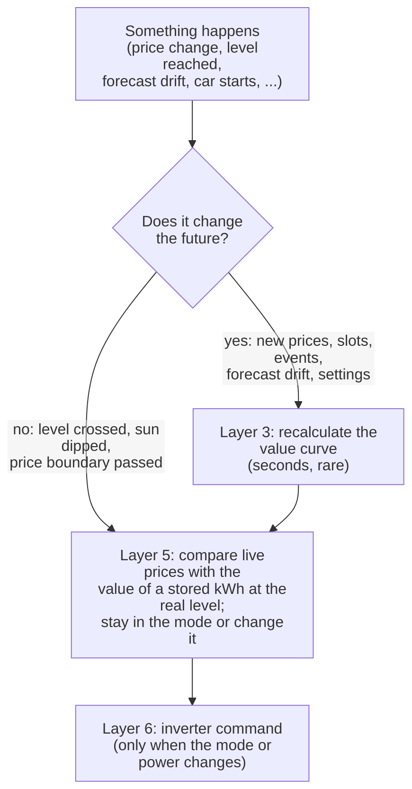
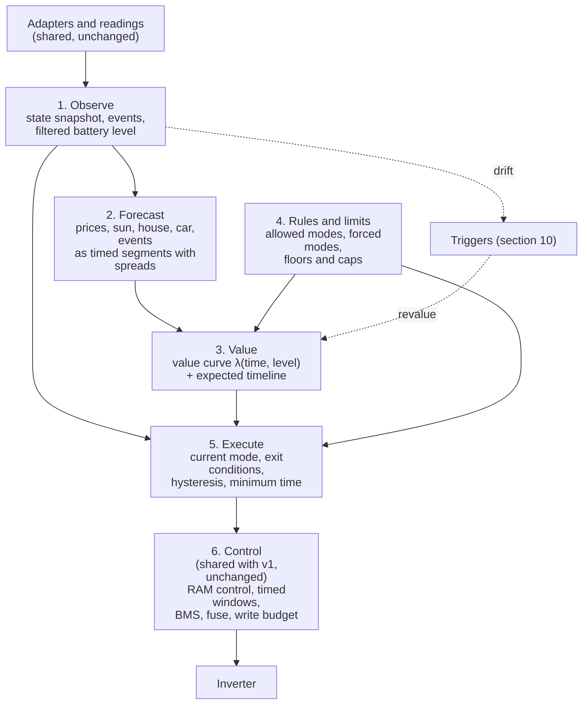
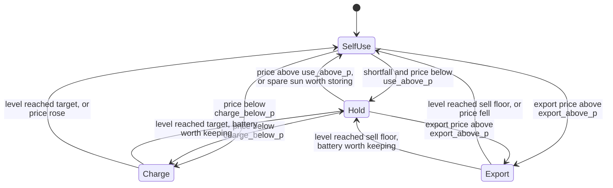

# Engine v2: event-driven planning and control

> **Status: design draft for review (5 Oct 2026). Nothing built.** No code, no settings and no entities exist yet. The
> owner's decisions so far: v2 is a clean design (it does not reuse v1's planner, optimiser or `decide`); the Plan view shows
> both the expected timeline and the value curve; no shadow run, v2 is tested on recorded and simulated data and then
> switched on live; v1 and v2 settings are separate. The card layout comes after this plan has been reviewed (section 11).

The engine that runs today becomes **engine v1**. Engine v2 is a second engine the owner can choose with one setting.
Both sit on the same adapters, readings, learning and inverter control. Only the part that decides changes.

## Contents

1. [Why a second engine](#1-why-a-second-engine)
2. [The idea in one page](#2-the-idea-in-one-page)
3. [The layers](#3-the-layers)
4. [Layer 1: Observe (state, events, SoC estimate)](#4-layer-1-observe)
5. [Layer 2: Forecast (the world model)](#5-layer-2-forecast)
6. [Layer 3: Value (what a stored kWh is worth)](#6-layer-3-value)
7. [Layer 4: Rules and limits (who may do what)](#7-layer-4-rules-and-limits)
8. [Layer 5: Execute (modes, exit conditions, hysteresis)](#8-layer-5-execute)
9. [Layer 6: Control (shared with v1)](#9-layer-6-control-shared-with-v1)
10. [Triggers: what makes what happen](#10-triggers-what-makes-what-happen)
11. [Settings: v1 and v2 kept apart](#11-settings-v1-and-v2-kept-apart)
12. [Outputs and what the card will show](#12-outputs-and-what-the-card-will-show)
13. [Expected behaviours (the test list)](#13-expected-behaviours)
14. [Testing without a shadow run](#14-testing-without-a-shadow-run)
15. [Guardrails, and how v2 keeps each one](#15-guardrails)
16. [Stages](#16-stages)
17. [Risks and limits](#17-risks-and-limits)
18. [Questions for the owner](#18-questions-for-the-owner)
19. [Sources](#19-sources)

---

## 1. Why a second engine

v1 plans in fixed half-hours and re-reads the first half-hour every 30 seconds. Reality moves inside each half-hour (house
load, cloud, smart slots that start at 23:12 and end at 00:47, a car that wakes for a minute), so the plan is often wrong
by the time it is acted on. Most of v1's recent fixes patch the effects of the time grid, not wrong economics:

| v1 mechanism | The time-grid problem it patches |
|---|---|
| Target latch (`_held_at_target`) | A charge target is a half-hour's end SoC, so it is "reached" mid-slot, then the SoC reading dips a point and it charges again |
| Early-target replan (`_early_target`) | After reaching the target, the rest of the half-hour is wasted holding |
| Mid-slot stick (£0.15) and the 5-minute replan | Replans part-way through a half-hour flip near-ties |
| Partial first slot (`first_h`) | A plan made at 20:17 has to pretend the slot started at 20:00 |
| Soft arbitrage band | Sales and refills don't fit whole half-hours, so cycles end in idle slivers |
| Solar-only charge and hold passes | A half-hour's action is fixed for 30 minutes while the sun is not |
| Car "running half-hour only" rule | The car can only be planned per half-hour |
| Three definitions of "cheap" (F4), reserve checked in one place only (F5, F12) | Plan and live decision are separate rule sets that drift apart |

v2 removes the grid from **deciding**. Forecasts still have times, and the plan still shows when things are expected, but
the engine acts when a **condition** is met: a level is reached, a price changes, the sun falls short of the forecast, the
car starts. The few things that really are times (a price change, a smart slot starting, a grid event) are treated as
**events** like any other, so the engine reacts at the moment they happen, not at the next half-hour.

## 2. The idea in one page

Three well-tried techniques, one per layer, explained in full in the layer sections:

1. **Water value** (hydro scheduling, since the 1960s). Instead of a schedule ("charge 01:00 to 04:30"), the planner works
   out **what one more kWh in the battery is worth**, for each battery level, over the coming hours: the value curve
   λ(time, level), in pence per kWh. The live decision then compares today's prices with that value, at whatever level
   the battery is really at. If reality has drifted from the forecast, the answer is still right for the real level.
2. **Event-triggered receding horizon (event-triggered MPC).** The value curve is recalculated only when something that
   changes the future happens (new prices, new smart slots, a forecast that has drifted too far, the car's state), not
   every 5 minutes.
3. **Hybrid automaton (modes with exit conditions).** The inverter is in one mode at a time (Self-use, Hold, Charge,
   Export). Each mode has conditions that keep it there and conditions that end it, with **hysteresis** (different
   thresholds to enter and to leave) and a **minimum time in a mode**, so readings that wobble cannot make it flip.



The economic core is the same question v1 asks (what is cheapest overall?), answered in a form that does not go stale
when the house does something unexpected.

## 3. The layers



| Layer | Job | Runs | Main output | New or shared |
|---|---|---|---|---|
| 1 Observe | Turn readings into a state and a stream of events | Continuously (on entity changes, plus a short sample tick) | `State`, events, filtered SoC | New (uses the shared readings) |
| 2 Forecast | What prices, sun, house load, car and events are expected, and how unsure | When an input that feeds it changes | `Forecast` (segments with spreads) | New (uses the shared load profile and adapters) |
| 3 Value | What a stored kWh is worth at each level and time | On a revalue trigger only | Value curve, thresholds, expected timeline | New |
| 4 Rules and limits | Which modes are allowed or forced now and in each future segment | Whenever asked by 3 or 5 | Allowed set, forced mode, floors, caps | New (one function used by both 3 and 5) |
| 5 Execute | Pick the mode now, keep it until a condition ends it | On every event | A `Decision` (the same type v1 produces) | New |
| 6 Control | Turn the decision into inverter writes safely | As today | Inverter commands | **Shared, unchanged** |

The same `Decision` type goes to layer 6, so RAM control, timed windows, BMS limits, the fuse cap, the write budget,
read-back checks, the following check and step-down all keep working without change.

Each layer section below has the same parts: **job**, **inputs from entities**, **inputs from settings**, **outputs**,
**the model**, **expected behaviour**, and **model parameters** (what can be set, what is learned, and what each changes).

---

## 4. Layer 1: Observe

**Job.** Keep one up-to-date picture of the house, and say when something has **happened** (an event), so that nothing
downstream polls on a timer to find out.

### Inputs from entities (all existing roles, read through the existing adapters)

| Input | Role(s) | Used for |
|---|---|---|
| Battery level, battery power | `battery_soc`, battery power role | Filtered level (below), guards |
| Grid, house, solar power | grid, house and solar power roles; check meter if mapped | Net load now, forecast drift |
| Import rate now, all published rates, export rate | Tariff adapter | Price events, layer 2 |
| Smart-charge dispatches | Tariff adapter | Slot start/end events, layer 2 |
| Grid event, free-power session | Events adapter (`<<event>>`) and tariff adapter | Scheduled and active events |
| Car charger plug, status, power | EV adapter | Car events |
| Solar forecast with low/high bands | Forecast adapter (`detailedForecast`) | Layer 2 |
| BMS charge/discharge limits, battery temperature estimate | BMS roles, cold-battery model | Layer 4 caps |
| Pause, Active/Passive, override | PowerEngine's own switches and `override.json` | Layer 4 |

v2 needs **no new entity roles**.

### Inputs from settings

| Setting (v2) | Default | Meaning |
|---|---|---|
| `sample_s` | 10 s | How often the power and level readings are sampled to check guards and drift. **Reading** on a tick is fine; **deciding** is not tied to it |
| `debounce_s` | 20 s | A changed reading must persist this long before it becomes an event (sign of net load, price "now" changing to unavailable and back) |
| `car_start_debounce_s` | 60 s | The car must report charging this long before "car charging" is an event (the car-wake blips are 15 to 70 s) |
| `car_stop_debounce_s` | 30 s | The car must report not charging this long before "car stopped" |
| `stale_after_s` | 180 s | A missing required reading becomes a "data missing" event only after this (replaces v1's data-gap bridge) |
| `soc_filter_gain` | 0.05 per sample | How quickly the filtered level is pulled to the reported one (below) |

### Outputs

* **`State`**: the latest readings, the filtered level (kWh and %), net load now, the car state, the active and scheduled
  events, and the age of each reading.
* **Events** (a queue, oldest first): each one carries a kind, a time and what changed. The catalogue is in section 10.
* **Drift**: the running difference between what happened and what layer 2 forecast (used by the triggers).

### The model: a filtered battery level (coulomb counting with correction)

The inverter's SoC is a whole percent, and on this battery it reads a point lower while charging than while holding.
v1 works around that with the 2-point latch. v2 fixes it where it starts, with a standard battery-management technique:
**coulomb counting corrected by the reported value** (a complementary filter, the simple form of the Kalman filter used in
battery management systems).

```
level_est ← level_est + battery_power × Δt × (η_charge if charging, else 1/η_discharge)   (count the energy)
level_est ← level_est + K × (reported_level + offset[mode] − level_est)                  (pull towards the reading)
```

* `K` is `soc_filter_gain`. Small: the estimate is smooth and follows the energy; large: it follows the reading.
* `offset[mode]` is the **learned** gap between the reported level and the true one in each mode (charging, holding,
  discharging). Learned from how the reported level jumps when the mode changes with no energy flowing.
* At start-up, and if the estimate and the reading differ by more than 3 points for 10 minutes, the estimate is reset to
  the reading (a battery recalibration or a wrong efficiency must not leave it adrift).
* The **reported** level is still what the card shows as "battery". The filtered level is what guards use, and it is
  published next to it (section 12) so the difference can be checked.

### Expected behaviour

* At a charge target of 94%, the reading going 94, 93, 94 makes no difference: the filtered level moves smoothly through it
  and the exit condition fires once.
* A one-minute car blip produces no car event. A five-minute charge produces "car started" after a minute and "car
  stopped" 30 s after it ends.
* A rate that is unavailable for one reading produces no event at all.

### Model parameters

| Parameter | Set or learned | What changes if it is wrong |
|---|---|---|
| `soc_filter_gain` | Set | Too small: slow to notice a recalibration. Too large: the reading's wobble comes back |
| `offset[mode]` | Learned (switch `learn_soc_offset`, on) | Exits fire a point early or late |
| Debounce times | Set | Too short: blips cause mode changes. Too long: a real change is answered late |

---

## 5. Layer 2: Forecast

**Job.** Describe the next 36 to 48 hours as **segments**: stretches of time in which prices, events and the car state
are constant and sun and house load change little. Give each segment a central estimate and a spread.

### Segments, not half-hours

A segment boundary is placed at every time something changes **in the data**:

* every price change in the published rates;
* every smart-slot start and end, at its real minute (23:12, 00:47);
* every grid-event and free-power start and end;
* the end of the overnight window;
* every forecast point of the sun and the house profile (these sources are half-hourly, so many boundaries still fall
  on :00 and :30, because that is where the data changes);
* and no segment longer than `max_segment_min` (30 minutes), so a long cheap night still has a value per half-hour of sun
  and load.

The honest difference from v1: the **plan** still has a time axis made of the data's own steps, but nothing is decided
by waiting for a boundary. A boundary in the plan is only a point where the value can change; whether the inverter
changes is decided by layer 5 when the event arrives.

### Inputs from entities

As layer 1 (prices, dispatches, events, forecast with bands, car state), plus the house load profile and the learned
measurements, which are **shared with v1** (they are facts about the house, not choices of an engine: section 11).

### Inputs from settings

| Setting | Default | Meaning |
|---|---|---|
| `max_segment_min` (v2) | 30 | Longest segment |
| `horizon_min_h`, `horizon_max_h` (v2) | 36, 48 | How far ahead; prices beyond the published ones are estimated |
| `solar_weights` (v2) | 0.25 / 0.5 / 0.25 | Weight of the low, central and high solar forecast (the bands v1 never used, F6) |
| `load_spread` (v2) | learned | How far the house usually is from its profile, per time of day |

### Outputs: `Forecast`

Per segment: start, end; import price, export price; a **smart-slot probability** (the learned certainty) and the price
with and without it; grid event or free power (with value); solar kWh at low, central and high; house kWh at low, central and
high; whether the car is charging (only the running segment, as in v1 0.9.103: the plan assumes no car it can't see);
`price_estimated`.

### The model

* **Sun:** the forecast adapter's central and 10/90 percent bands, scaled by a **learned bias** per time of day
  (actual divided by forecast over the last 14 days; `learn_solar_bias`, on). Three scenarios, weighted by `solar_weights`.
* **House:** the shared profile (weekday/weekend, half-life 7 days) as the centre; low and high from the learned spread of
  the actual load around it (the 20th and 80th percentiles of the residual for that time of day). Three scenarios.
* **Smart slots:** two outcomes, the slot happens (its price) or does not (the standard price), with the learned certainty
  as the probability. Unlike v1, the slot is **not** averaged into one expected price (section 6 explains why).
* **Estimated prices** beyond the published ones: the same time yesterday, except that yesterday's smart-slot price is
  not carried over (v1's rule, kept).

### Expected behaviour

* A smart slot announced for 23:12 to 00:47 appears as one segment with those times and its certainty.
* A day with a poor solar forecast record (the sun usually below the central figure) plans with the learned bias, so the
  battery is not relied on to fill from the sun that rarely comes.

### Model parameters

| Parameter | Set or learned | What changes |
|---|---|---|
| `solar_weights` | Set | Heavier low weight: more cautious (more grid charging on doubtful days) |
| Solar bias | Learned | Corrects a forecast that is consistently high or low |
| Load spread | Learned | Wider: more caution about the evening; narrower: closer to the central plan |
| Smart-slot certainty | Learned (shared with v1) | How much an announced slot is relied on |

---

## 6. Layer 3: Value

**Job.** Work out the **value curve**: for every segment and every battery level, what one more kWh in the battery is
worth, in pence. From it, derive the price thresholds layer 5 uses, and an **expected timeline** to show on the Plan view.

### Inputs

* `Forecast` (layer 2), the starting level (filtered, layer 1).
* The allowed and forced modes per segment and the floors and caps (layer 4).
* Battery facts (shared): capacity, efficiency each way (learned), maximum charge and discharge power (learned, tapers),
  reserve, export limit, fuse.

### Inputs from settings (v2)

| Setting | Default | Meaning |
|---|---|---|
| `level_step_kwh` | 0.1 | Resolution of the level grid (181 levels for 18 kWh) |
| `wear_p` | 2 p/kWh | Battery wear per kWh taken out (question 18.4: also on Self-use?) |
| `event_value_p` | 100 p/kWh | What a grid event pays per kWh, before the export rate (v1's constant, F7) |
| `event_plus_export` | on | The export rate is paid on top |
| `terminal_value` | `refill` | Value of energy left at the end of the horizon: `refill` = the cheapest non-free import price expected in the last 24 h of the horizon, divided by the charge efficiency (fixes F11); or a fixed figure |
| `comfort_low_soc`, `comfort_high_soc` | none / none | Optional soft band for battery health: a cost per kWh of time spent outside it (replaces v1's arbitrage band; off unless set) |
| `comfort_cost_p` | 1 p/kWh | That cost |

### The model: stochastic dynamic programming for the value of stored energy

This is the **water value** method used to run hydro reservoirs, applied to a battery. The battery level is the only state,
so it is solved exactly on a grid, backwards from the end of the horizon.

**Notation.** Segments `k = 1..K`, each `Δk` hours long. Level `e` (kWh). Scenario `ω` (sun low/central/high × house
low/central/high × smart slot yes/no, with their probabilities). Mode `m` from the allowed set `Mk`. `f(e, m, ω)` is the
level at the end of the segment (the battery physics, with tapers and limits); `c(e, m, ω)` is its cash cost (import ×
price − export × price + wear + comfort cost).

**Expected cost from segment k on, starting at level e:**

```
V_{K+1}(e) = − terminal_value × e
V_k(e)     = Σ_price-outcomes P(outcome) × min over m in M_k [ Σ_ω P(ω) × ( c(e, m, ω) + V_{k+1}(f(e, m, ω)) ) ]
```

* **The price outcome (smart slot or not) is known before choosing** (the engine sees a slot start or not start), so the
  minimum is inside it. This keeps the **option value** of an uncertain slot, which v1's averaged price loses: v1 prices a
  70%-certain slot at a blend that is neither the slot nor the peak, and plans for a price that never happens.
* **The sun and the house are not known in advance** (they unfold during the segment), so the mode is chosen against their
  expected outcome.

**The value curve** is the slope:

```
λ_k(e) = ( V_k(e − step) − V_k(e + step) ) / (2 × step)        pence per kWh stored
```

λ is high when the battery is low before a dear evening, and falls as the level rises (each extra kWh is needed less).

**From value to thresholds** (with `η_c`, `η_d` the one-way efficiencies, `w` the wear, all at the current level):

| Question | Yes when | Name in the outputs |
|---|---|---|
| Is it worth buying a kWh to store? | import price < η_c × λ | `charge_below_p` = η_c × λ |
| Is it worth selling a stored kWh? | export price > λ / η_d + w | `export_above_p` |
| Should the battery cover the house (Self-use), rather than the grid (Hold)? | import price > λ / η_d + w | `use_above_p` |
| Should spare sun go into the battery rather than out? | η_c × λ > export price | `store_sun_above_p` (the export price it beats) |

These four comparisons are the minimum of the "cost now plus value of energy moved" per mode (in control theory, the
Hamiltonian with λ as the costate, Pontryagin's principle). Because the battery's cost is linear in power within its limits,
the best action is always at a limit (full power or none) between thresholds: a **threshold policy**. The research on battery
arbitrage finds this structure is optimal or close to it.

**Where a mode should stop.** For a charge, the level `e*` where η_c × λ(e*) meets the import price is the level at which
another kWh is no longer worth buying: that is the **charge target**, worked out, not set. For a sale, the level where
λ / η_d + w meets the export price is the **sell floor**. Both move when the value curve is recalculated.

**The expected timeline.** Running forward from the real level with the central scenario and the threshold policy gives the
modes and levels expected over time (and with the low and high scenarios, a band around the level). This is what the plot
draws. It is **only a forecast**: nothing waits for its times.

### Outputs

* The **value curve** λ(segment, level), and the thresholds now (the table above) at the filtered level.
* The **charge target** and **sell floor** for the segment now.
* The **expected timeline**: a list of (mode, expected start, expected end, start level, end level, reason), and the level
  path at low, central and high.
* Expected cost of the horizon, and the same for "do nothing" (Self-use throughout) for comparison.
* The **reason** for each expected mode, in plain words, naming the prices: "Charge at 6.99p: a stored kWh is worth 24.1p
  here, because the house would otherwise buy at 30.28p from 16:00."

### Expected behaviour

* A cheap night before a dear day: λ in the night is about the evening's price / η (the battery will save that), so
  charging is worth it until the level where the evening's need is covered; λ above that level falls to about the next
  night's refill price, below 6.99p / η_c, so charging stops there. The target appears without a target setting.
* A sunny day ahead: λ overnight falls (the sun will fill the battery for free), so the night charge stops lower.
* A grid event at 16:00 paying 115p: λ before it rises towards 115p × η_d for the levels the event can use, so a charge
  at a price below that is worth it, and selling at 15p is not, and so on, with no separate "pre-event" rule.

### Model parameters

| Parameter | Set or learned | Effect |
|---|---|---|
| `level_step_kwh` | Set | Smaller: finer targets, slower to compute (section 17) |
| `wear_p` | Set | Higher: fewer cycles, more Hold in near-ties |
| `terminal_value` | Set | Low: the plan lets the battery run down near the end of the horizon; high: it keeps energy |
| `comfort_*` | Set | Keeps the battery out of the top or bottom when nothing is lost by it |
| Efficiencies, power limits, tapers, capacity | Learned (shared) | All thresholds |
| Smart-slot certainty, solar bias, load spread | Learned (layer 2) | λ before slots and on doubtful days |

---

## 7. Layer 4: Rules and limits

**Job.** One function that answers, for "now" and for every future segment: **which modes are allowed, which (if any) is
forced, and what floors and caps apply.** Layer 3 plans with it and layer 5 acts with it, so the plan and the live
decision can never disagree about the rules (v1's F4, F5 and F12 came from two rule sets).

### Inputs

Entities: grid event state, free-power session, the car's state (from layer 1, debounced), the override, pause and mode,
BMS limits, cold caution, fuse headroom. Settings: as in the table below.

### The rules, in order (the first that applies wins)

| # | Situation | Allowed / forced | Notes |
|---|---|---|---|
| 1 | Not Active (Passive, Paused, unconfigured, Active refused) | Decided as normal, **not sent** ("Would ...") | Unchanged from v1: Active, Passive and Pause are the owner's |
| 2 | Grid event in progress, `events` on | **Forced Export** at the event's power | The reserve applies unless `event_below_reserve` is on (question 18.3) |
| 3 | Owner's override | **Forced** to the override's mode | Same choices and periods as v1's override; the reserve still applies to Self-use and Export; Charge stops at its target with hysteresis |
| 4 | Free-power session | **Forced Charge** to 100% | |
| 5 | Car charging (debounced), `house_load_includes_ev` | Allowed: **Hold, Charge** only | The battery never feeds the car |
| 6 | Level at or below the reserve | No discharge mode (Self-use becomes Hold, no Export) | Applies to **every** discharge mode, at the **learned** reserve (fixes F5, F12) |
| 7 | Otherwise | Self-use, Hold, Charge; Export if `arbitrage` is on | |

**Caps** (applied to the power of the chosen mode): fuse headroom (house + car + battery under 90% of the main fuse), BMS
limits, cold-battery factor, export limit. These caps are also in layer 3's physics, so the plan expects them.

**Charge needs a cheap price by construction.** Layer 5 can only enter Charge when the live import price is below
`charge_below_p`, so a forced charge at a dear price that the plan did not count cannot happen (the 29 Sep 2026
guardrail). Storing spare sun is done by Self-use, never by Charge.

### Outputs

For "now" and per segment: `allowed` (a set of modes), `forced` (a mode or none), `floor` (lowest level for a discharge),
`ceiling` (highest level for a charge, if any), `caps` (charge and discharge watts), and the **reason** for each
restriction ("car charging: the battery holds").

### Model parameters (v2 settings)

| Setting | Default | Meaning |
|---|---|---|
| `reserve_soc` | 12 % | Floor for every discharge (raised by the learned reserve, shared) |
| `charge_ceiling_soc` | 100 % | Highest level a grid charge may reach (a real ceiling, unlike v1's F2) |
| `arbitrage` | off | Allow Export outside grid events |
| `events` | on | Act on grid events |
| `free_power` | on | Act on free-power sessions |
| `event_below_reserve` | off | May a grid event discharge below the reserve? |

---

## 8. Layer 5: Execute

**Job.** Be in one mode at a time. On each event, decide whether the current mode still holds, and if not, which mode is
next. Produce the `Decision` for layer 6. Never decide on a timer.

### The model: a hybrid automaton

A hybrid automaton (hybrid systems theory; used for supervisory energy management in microgrids) is a set of **modes**.
In each mode the continuous state (the battery level) changes in its own way. Each mode has:

* an **invariant**: what must stay true while in the mode;
* **guards**: conditions that, when they become true, end the mode;
* an **entry action**: the inverter command.

| Mode | Entry action (to layer 6) | Stays while (invariant) | Ends when (guards) |
|---|---|---|---|
| **Self-use** | Remote control Off (the inverter's own self-use) | The house's import price is above `use_above_p` − band, or there is spare sun worth storing | Price event; the level reaches the reserve; spare sun turns to shortfall and the price is below `use_above_p` (debounced); a forced mode |
| **Hold** | Force charge at 0 W | The battery is worth more than the price of serving the house from the grid | Price event; shortfall turns to spare sun worth storing (debounced); a forced mode |
| **Charge** | Force charge at the capped power | import price < `charge_below_p` − band, and the level is below the charge target | **The filtered level reaches the charge target**; price event; car, event or override change; **deadline** |
| **Export** | Force discharge at the capped power | export price > `export_above_p` + band, and the level is above the sell floor | **The level reaches the sell floor**; price event; **deadline**; a forced mode |

**Choosing the next mode.** On every event: (1) take the allowed and forced modes from layer 4; (2) if one is forced, that is
the mode; (3) otherwise evaluate the four threshold questions of layer 3 at the **filtered level and the live prices**;
(4) apply hysteresis and minimum time in a mode (below); (5) if the mode or its power changes, hand a `Decision` to layer 6.



(Forced modes from layer 4, such as a grid event, can be entered from any mode and leave back to the choice above.)

### Hysteresis and minimum time

Without these, any threshold policy chatters (a level or price sitting on a threshold). Both are standard in switched
control.

* **Price band** `price_band_p` (0.5p): to enter Charge the price must be below the threshold minus the band; to stay, below
  the threshold plus the band. The same for Export and for Self-use against Hold.
* **Level band** `level_band_pct` (1 point): a charge that ended at its target restarts only when the level is a point below
  the (possibly new) target. With the filtered level (layer 1), 1 point is enough; v1 needed 2 on the raw reading.
* **Minimum time in a mode** `min_dwell_s`: no change of mode sooner than this after the last one, **except** for safety
  events (reserve, grid event start or end, car start, override, pause, data missing, BMS zero), which always act at once.
  Default derived from the control method: **RAM control 120 s**, **timed windows 15 minutes** (each change there is an EEPROM
  write).

### Deadlines: a condition that never comes

"Charge until 90%" may never reach 90% (the BMS slows the charge, the cold, a fuse cap). Each Charge and Export gets a
**deadline**: the time the expected timeline says it should end, plus `deadline_grace_min` (10 minutes). Missing a deadline
is an event: the mode is re-checked against the live prices (often it simply carries on, because charging is still worth it)
and a **revalue** is triggered, because the battery is doing something the model did not expect. A deadline never stops a
mode on its own; it only makes the engine look again.

### Outputs

* A `Decision` (action, target level, power, reason, rule) for layer 6: the same type v1 produces.
* The **current mode** with: when it started, why (the event and the prices and value that chose it), its exit conditions
  with the expected time of each, its deadline.
* A **journal** row on every mode change: time, event, previous and new mode, level, prices, λ, thresholds. The diagnostics
  export carries the last few hundred; `tools/diag_summary.py` gains a v2 section.

### Expected behaviour

* Reaching a target four minutes into a half-hour ends the charge four minutes into the half-hour, and the next mode starts
  then. No latch, no "rest of the half-hour", no early-target replan.
* A cloud that turns spare sun into shortfall for 10 seconds changes nothing (debounce); for two minutes it may change
  Self-use to Hold if the battery is worth more than the import price; the change happens once.
* A price change at 05:30 is an event at 05:30:00, and the mode changes then if the thresholds say so.

### Model parameters (v2 settings)

| Setting | Default | Effect |
|---|---|---|
| `price_band_p` | 0.5 p | Larger: fewer changes, slightly less gain |
| `level_band_pct` | 1 | As above, for levels |
| `min_dwell_s` | 120 (RAM) / 900 (timed) | Larger: fewer writes, slower to follow |
| `deadline_grace_min` | 10 | How late a mode may run past its expected end before the engine looks again |

---

## 9. Layer 6: Control (shared with v1)

Unchanged. It receives a `Decision` and does what it does today: RAM remote control (command mapping, refresh every
minute while a force command is on, power-mode-power sending, following check, step-down after a miss, BMS caps, fuse cap),
or timed windows (periods, read-back, update button, write budget, damping). See [../logic/06-to-inverter.md](../logic/06-to-inverter.md).

Two connection points need care:

* **Timed windows want a schedule ahead**, not just "now". v2 gives them the expected timeline's next 24 hours as the
  periods (the same shape v1's plan gives `periods()`), with the live mode replacing the period running now, as in v1. On
  timed windows v2 is therefore less event-driven: the inverter runs the windows itself. RAM control is the primary target.
* **Dampening** (timed windows) stays; v2's minimum time in a mode makes it act less often.

---

## 10. Triggers: what makes what happen

Two kinds of reaction, at very different costs:

* **Re-check** (layer 5 only): microseconds. Compare the live prices and level with the thresholds already worked out.
* **Revalue** (layers 2 and 3, then a re-check): a few seconds (section 17). Recalculates the value curve.

The point of the value curve covering **every level** is that a level that has drifted from the forecast needs only a
re-check, not a revalue. v1 had to replan for it.

| Event | Source | Debounce | Re-check | Revalue |
|---|---|---|---|---|
| Level reaches an exit level (target, floor, reserve) | Layer 1 (filtered level) | none (the filter is the smoothing) | yes | no |
| Price boundary passes (published or estimated) | Scheduled from layer 2 | none | yes | no |
| Smart slot starts or ends (on time) | Scheduled | none | yes | no |
| Smart slot added, moved, withdrawn, cut short | Tariff adapter | `debounce_s` | yes | **yes** |
| New prices published | Tariff adapter | `debounce_s` | yes | **yes** |
| Grid event or free power announced, changed, started, ended | Adapters | none for start and end; `debounce_s` for changes | yes | **yes** |
| Car started or stopped charging | EV adapter | `car_start_debounce_s`, `car_stop_debounce_s` | yes | **yes** |
| Spare sun turns to shortfall or back | Layer 1 (net load sign) | `debounce_s` | yes | no |
| **Forecast drift**: what has happened since the last revalue differs from the forecast by more than `drift_kwh` (CUSUM, below) | Layer 1 | built in | yes | **yes** |
| Solar forecast updated, and the day's remaining total moved by more than `forecast_change_pct` | Forecast adapter | `debounce_s` | no | **yes** |
| A deadline missed | Layer 5 | none | yes | **yes** |
| Override set, changed, cancelled, expired | `pe_override` | none | yes | **yes** |
| Pause, Active/Passive changed | Switches | none | yes | no |
| A v2 setting saved | Config | none | yes | **yes** |
| Learned values changed (efficiency, limits, reserve, load profile) | Learning | none | no | **yes** (fixes F13) |
| BMS limit changed by more than 500 W, or to 0 | BMS roles | `debounce_s` | yes | no (caps act at once; the plan's limit is refreshed at the next revalue) |
| Required reading missing for `stale_after_s` | Layer 1 | the stale time | yes (data-missing rule) | no |
| **Backstop**: no revalue for `max_value_age_min` | Timer | none | no | **yes** |

* **Coalescing.** Revalue requests that arrive within `revalue_coalesce_s` (10 s) of each other run once. A revalue already
  running finishes, then runs once more if new requests came in.
* **The backstop** is the one plain timer (default 120 minutes). It exists in case a trigger is missed; the journal says when
  a revalue came from the backstop, so it can be checked that this is rare.
* **Forecast drift, the model: CUSUM.** The cumulative sum (Page's CUSUM change detection, a standard method for noticing
  when a process has moved away from its expected value) of (actual net load − forecast net load) since the last revalue,
  in kWh. When its size passes `drift_kwh` (0.75 kWh, about 4 points of this battery), the future has changed enough to
  revalue. Short wobbles cancel out; a steady shortfall of sun adds up and triggers. A second check: the real level outside
  the low-to-high band of the expected timeline for `band_exit_min` (10 minutes).

### Settings (v2)

| Setting | Default | Effect |
|---|---|---|
| `drift_kwh` | 0.75 | Smaller: revalues more often on forecast error |
| `band_exit_min` | 10 | How long outside the expected band before revaluing |
| `forecast_change_pct` | 10 | How much a solar forecast update must move the day to matter |
| `revalue_coalesce_s` | 10 | Batches bursts of events |
| `max_value_age_min` | 120 | The backstop |

---

## 11. Settings: v1 and v2 kept apart

**Decided by the owner:** v1 and v2 have separate settings, even where the defaults are the same, so each engine can be
tuned without moving the other.

### Proposal

* A new system setting **`engine`**: `v1` (default) or `v2`.
* v2's settings live in their own block, `engine_v2:` in `config.yaml`, with their own catalogue (keys, defaults, ranges,
  help text) in a new module, so a v1 key and a v2 key can never be confused, and a v1 setting can be retired later
  without touching v2.
* **What stays shared, and why.** Some settings are not choices of an engine but **facts about the house**. Two copies of
  them would let the engines disagree about the hardware (a 60 A fuse for one and 80 A for the other), which is a source of
  mistakes, not of tuning. I propose these stay single and shared:

| Shared (facts about the house and the owner's equipment) | Separate (engine choices) |
|---|---|
| Battery capacity, efficiencies, power limits (roles and their measured values) | Reserve, charge ceiling, wear cost |
| Main fuse, export limit, inverter output limit, car charger kW | Arbitrage on/off, grid events on/off, free power on/off |
| Control method, `ram_max_power_w`, write budget, dampening (all layer 6) | Event value, terminal value, comfort band |
| House load includes the car, battery location | Everything in sections 4 to 10 marked (v2) |
| Overnight window (learned or fixed: a fact about the tariff) | v1's whole current list (arbitrage band, cheap threshold, top-up, switch costs, ...) stays v1's |
| Learned measurements: load profile, smart-slot certainty, tapers, learned reserve, cold model | |
| Smart-charge requests to the supplier (not part of either engine) | |

  Where a setting is a **policy** both engines have today (the reserve, for example), v2 gets its own copy, starting from v1's
  value when v2 is first selected (copied once, then independent). Question 18.1 asks the owner to confirm the split.

* **Switching engines.** Takes effect at once, without changing Active, Passive or Pause (those are the owner's). While v2
  makes its first value curve (a few seconds) the inverter keeps the command it has. Layer 6 state (write budget, RAM refresh,
  step-down) carries over because it is shared. The switch is journalled and notified. Switching back to v1 is the
  rollback, and is the same action.
* **Config page.** Each engine's settings in their own clearly labelled group; the engine not in use folded away and marked
  "not in use". The detailed layout is for after this review (section 12).

---

## 12. Outputs and what the card will show

Decided: **both** the expected timeline and the value curve are shown. Entity names below are a first proposal; the card
layout is agreed after this plan has been reviewed.

| Output | Entity (proposal) | Content | Size note |
|---|---|---|---|
| Decision | The existing decision sensor, filled by whichever engine runs | Action, target, power, sentence with prices | Unchanged |
| Engine in use | `sensor.pe_diag_version` attribute `engine` | `v1` or `v2` | Tiny |
| Mode now | `sensor.pe_v2_mode` | State: the mode. Attributes: since, why, exit conditions with expected times, deadline, filtered and reported level | Small |
| Value now | `sensor.pe_v2_value` | State: λ at the filtered level (p/kWh). Attributes: `charge_below_p`, `export_above_p`, `use_above_p`, `store_sun_above_p`, charge target, sell floor | Small |
| Expected timeline | `sensor.pe_v2_timeline` | Modes with expected start and end, levels, reasons; the level path at low, central and high | About 6 KB for 48 h; checked against the 15,000-byte warning |
| Value curve | `sensor.pe_v2_value_curve` | λ on 11 levels (0, 10, ..., 100%) per hour for 48 h | About 4 KB |
| Triggers | `sensor.pe_v2_triggers` | The last 30 events and what each caused (re-check, revalue, mode change) | About 4 KB |
| Journal | Diagnostics export section `engine_v2` | Mode changes and revalues with their inputs | Not an entity |

**First ideas for the card, for discussion after review:**

* **Plan view, timeline:** the existing plot style, with modes as coloured bands whose edges are **expected** times
  (shown softer than the past), the level line with its low-to-high band, and the exit condition written on each band
  ("until 88%", "until 16:00 price change").
* **Plan view, value curve:** a heat map (time across, level up, colour = p/kWh), the expected level path drawn over it,
  and the live price drawn as the threshold line where charging, holding or selling becomes worth it. The point of it is
  that you can see why the engine charges to 88% and not 95%: above 88% the stored kWh is worth less than the price.
* **Now panel:** "Charging until 88% (about 02:40) because a stored kWh is worth 24p and import is 6.99p" with the
  thresholds as small figures.
* **Health tab:** revalues per day, by trigger, and how many came from the backstop; mode changes per day; flip-flops
  (should be zero).

---

## 13. Expected behaviours

Each line becomes a test case (section 14). "Should" is the acceptance condition.

| # | Situation | v2 should | Because |
|---|---|---|---|
| B1 | Cheap night 6.99p, dear evening 30p tomorrow, dull day | Charge from the start of the cheap price until the level where a kWh is no longer worth 6.99p / η, then Self-use or Hold | λ at that level falls below the price |
| B2 | Same, sunny day forecast | Charge stops lower than B1 | λ falls when the sun will fill the battery |
| B3 | Charge target reached 12 minutes before the cheap price ends | Leave Charge at once; the next mode starts then; no restart when the reading dips a point | Exit is a level, the filtered level does not dip, hysteresis |
| B4 | Smart slot 23:12 to 00:47 announced at 21:00 | Charge (if worth it) starts at 23:12:00, not 23:00 or 23:30 | Slot start is a scheduled event |
| B5 | Smart slot withdrawn while it runs | Charge ends at the withdrawal (price event), and the value curve is recalculated | Price change re-check, slot change revalue |
| B6 | Car wakes for 60 s in a smart slot | Nothing changes | Car start debounce |
| B7 | Car charges for an hour in a dear period | Battery holds within a minute of the car starting; does not feed the car | Layer 4 rule 5 |
| B8 | Grid event 16:00 to 17:00 announced in the morning | Battery full enough at 16:00 for the event, charged at the cheapest worthwhile price before it; Export from 16:00:00; back to the choice at 17:00:00 | λ before the event, scheduled events |
| B9 | Sun 40% under forecast all afternoon | A revalue within the drift threshold (about 0.75 kWh of shortfall); the evening plan adapts | CUSUM drift |
| B10 | Passing clouds, net load crossing zero every 20 s | No mode changes caused by it | Debounce and minimum time in a mode |
| B11 | Import rate unavailable for one reading | Nothing changes | Stale time |
| B12 | Import rate missing for 10 minutes | Data-missing rule (as v1: hand back to Self-use after the grace) | Layer 4 |
| B13 | Export price above the value of a stored kWh, arbitrage on | Export until the sell floor, then stop | Threshold and exit level |
| B14 | Level at the reserve with a planned Export or Self-use | No discharge | Layer 4 rule 6 for every discharge mode |
| B15 | BMS limit drops to 0 while charging | Charge becomes Hold at once (layer 6, as v1) and the deadline check revalues if the charge cannot finish | Safety event |
| B16 | Price 30p, sun short, battery high, the evening is covered | Self-use (battery runs the house), never Charge | Charge only below `charge_below_p` |
| B17 | Spare sun, battery worth more than the export price | Self-use (stores the sun), never Hold | `store_sun_above_p` |
| B18 | Spare sun, battery full or worth less than the export price | Hold or Export as the thresholds say; the sun is exported | Same |
| B19 | Owner sets a Charge override for two hours | Charge to the override target, with the level band; the value curve is remade around it | Layer 4 rule 3 |
| B20 | AppDaemon restarts mid-charge | First value curve within seconds, the mode chosen from the live state, no gap in safety (RAM failsafe covers the restart) | Start-up is a revalue event |
| B21 | Switch from v1 to v2 while Active, mid-charge | The inverter keeps its command until v2's first decision; then v2's choice | Section 11 |
| B22 | A deadline passes with the charge still worthwhile | The charge carries on; a revalue is logged | Deadlines re-check, they do not stop |

**Properties that must hold in every test** (checked on every simulated minute):

* never Charge when the live import price is at or above `charge_below_p`;
* never discharge below the floor of layer 4;
* no more than one mode change per `min_dwell_s` except safety events;
* no A, B, A change within 10 minutes for the same reason (flip-flop);
* every mode change has a journal row naming its event, prices and value.

---

## 14. Testing without a shadow run

The owner's point: live data and recorded days are shaped by v1's decisions, so v2 can't be judged on them as they stand.
The answer is a **closed-loop simulation**, which PowerEngine already has the parts for.

* **What in a recorded day v1 did not affect:** house load, the car's draw, the sun, the prices, smart slots, grid events.
  These are the outside world.
* **What v1 did affect:** the battery level and the grid import and export. A simulation recomputes these from the world plus
  the engine's commands.
* **The demo world** (`pe_core/demo/world.py`, `DemoWorld`) already does exactly this: it plays a recorded day's load, sun and
  prices, simulates the battery (18 kWh, 95% each way, 5 kW, remote-control failsafe), and reads and writes the same
  entities as the real inverter. The replay harness drives the whole app with a fake clock.

So:

1. **Closed-loop runs.** v2 controls the simulated battery through the four demo days, the replay fixture's night, and
   more days built from diagnostics exports (`tests/replay/build_fixture.py`). **v1 runs on the same simulated days**, so
   the two are compared on equal terms: cost, number of mode changes, flip-flops, energy bought at peak.
2. **A perfect-foresight benchmark.** The same dynamic programme run on the actual (not forecast) day gives the lowest cost
   possible; both engines are reported as a gap to it. This says how much is left to gain and stops v2 from being judged only
   against v1.
3. **Disturbances.** The same days with the sun scaled down 40%, a smart slot withdrawn mid-run, car blips, the SoC reading
   offset while charging, a missing rate, a BMS limit falling to 0, a restart mid-charge. Each is a B-row of section 13.
4. **Property checks** from section 13 on every simulated minute.
5. **Pure unit tests** per layer: the filter, the segment builder, the value curve on hand-checkable cases (one cheap and one
   dear period: the charge target must be where the curve says), the threshold table, the automaton's transitions, the
   triggers.

**Before going live**, a short checklist for the owner: the runs above pass; the value curve on yesterday's real data looks
sensible on the card; RAM control; the first switch made at a quiet time (daytime, no event, no slot) and watched; rollback
is selecting v1.

---

## 15. Guardrails

| Guardrail (CLAUDE.md) | How v2 keeps it |
|---|---|
| Never write Backup or Off-Grid, or "bump"/"boost" entities | Layer 6 is unchanged and enforces it |
| Don't hammer external APIs | v2 reads entities only; smart-charge requests stay the shared step they are today |
| No admin token | Nothing new needs one |
| Active, Passive, Pause are the owner's | Layer 4 rule 1; switching engines changes none of them |
| Inverter writes are precious | Same layer 6, write budget, damping, read-back; v2 adds minimum time in a mode and makes fewer changes |
| Attributes under 16 KB | Sizes in section 12, measured by `_publish_state` |
| No supplier or device names in user text | v2's sentences use the names map (`N(term)`, `<<term>>`) |
| No forced charge at a dear price the plan didn't count | Charge is entered only below `charge_below_p`, computed from the live price; spare sun is stored by Self-use |
| Decisions at a charge target don't flip | The filtered level, the level band and minimum time replace the latch (`details["reached"]` is v1's and is not used by v2) |
| Display wording vs mode keys | v2 uses the same `effective` keys |

---

## 16. Stages

Each stage is a PR; nothing changes behaviour for v1 (the replay passes unchanged throughout).

| Stage | What | Behaviour change |
|---|---|---|
| **V0** | An engine interface: v1 wrapped behind it with no change; the `engine` setting (only `v1` accepted); `engine_v2` config block parsed and stored | None (replay unchanged) |
| **V1** | Layers 1 to 3 as pure code: filter, events, segments, value curve, thresholds, expected timeline; a tool that draws the value curve and timeline for a demo day or a diagnostics export | None |
| **V2** | Layers 4 and 5, triggers, journal; the closed-loop simulation and benchmark; the section 13 tests | None |
| **V3** | Wiring in the app (event queue on AppDaemon's state listeners and scheduler, sensors of section 12, diagnostics section); `engine: v2` accepted; demo mode runs v2 | Only when `v2` is chosen |
| **V4** | Card: settings groups, Plan view timeline and value curve, now panel, Health counts (after review; joint release, `MIN_*_VERSION`) | Card only |
| **V5** | The owner switches to v2 live; review after a week with `tools/diag_summary.py`'s v2 section | Owner's choice |

---

## 17. Risks and limits

* **Computing time.** 181 levels × about 96 segments × up to 18 scenarios × 4 modes is about 1.2 million physics steps per
  revalue, in pure Python (no numpy in the app). Estimate: a few seconds. Mitigations if needed: a coarser level grid far
  ahead (0.1 kWh for the next 12 hours, 0.5 kWh beyond), fewer scenarios beyond 24 hours, and running the revalue in a
  worker so events are never blocked. V1's tool will measure it on the owner's hardware profile.
* **Forecast errors are correlated** (a dull morning usually means a dull afternoon), but the scenarios treat segments
  independently. The drift trigger and revalue correct it as the day unfolds; a correlated scenario set is a later
  refinement if the tests show the need.
* **Timed-window installs** get less of the benefit (section 9).
* **The expected timeline is a forecast.** People will read its times as promises. The card must make clear that bands end
  on conditions.
* **A new model can be confidently wrong.** The value curve is only as good as the forecast and the learned facts. The
  simulation tests and the journal (every decision with its λ and prices) are there to make that visible quickly.
* **Event-driven code is harder to replay than a fixed loop.** The fake clock and the event queue must be deterministic
  (events at the same instant in a fixed order), or the tests become flaky.

## 18. Questions for the owner

1. **Shared or separate:** is the split in section 11 right (house facts shared, engine choices separate)?
2. **Comfort band:** v2 does not need an arbitrage band to work. Do you want the optional comfort band for battery health,
   and if so, where (for example 20 to 90%)?
3. **Grid event and the reserve:** may a grid event discharge below the reserve (v1 allows it, F5)?
4. **Wear on Self-use:** should wear be charged on the battery covering the house, or only on sales (v1 charges it on both,
   F10)? Charging it on Self-use makes the battery hold back for near-ties.
5. **Caution:** the default solar weights (25/50/25) plan on the middle. Do you want a more cautious default (for example
   40/50/10)?
6. **Backstop:** is 2 hours right for the one plain timer?

## 19. Sources

* Event-triggered MPC for building energy management (77 to 88% fewer optimisations): [Building and Environment, 2023](https://www.sciencedirect.com/science/article/abs/pii/S0360132323001282)
* Hybrid automata for energy management (modes, guards, invariants): [Renewable and Sustainable Energy Reviews, 2020](https://doi.org/10.1016/j.rser.2020.110118); [Supervisory Control of Hybrid Systems](https://www3.nd.edu/~pantsakl/Publications/246-Proc00.pdf)
* Threshold policies for battery arbitrage, and guard bands from forecast error: [arXiv 2601.12081](https://arxiv.org/html/2601.12081); [arXiv 2108.13511](https://arxiv.org/pdf/2108.13511)
* EMHASS (Home Assistant, periodic MPC): [docs](https://emhass.readthedocs.io/en/latest/usage_guide.html)
* HAEO (Home Assistant, re-optimises when inputs change, variable step lengths): [repository](https://github.com/hass-energy/haeo), [docs](https://haeo.io/latest/)
* Water values, Pontryagin's minimum principle, CUSUM and coulomb counting with correction are textbook methods (hydro
  scheduling, optimal control, statistical process control, battery management).
